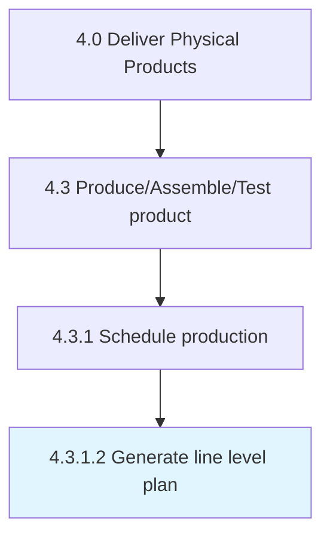

# Generate line level plan

> Initiating the line-level plan for production.

## Overview

Activity 4.3.1.2 is an activity within the Deliver Physical Products framework. 

Initiating the line-level plan for production. Break down the production schedule into specific lines, specifying the various objectives the production schedule.

## Process Hierarchy



## Key Statistics

| Metric | Value |
|--------|-------|
| APQC Code | 10306 |
| Hierarchy ID | 4.3.1.2 |
| Level | Activity |
| Parent | [4.3.1](../) |
| Sub-Processes | 0 |


## GraphDL Semantic Structure

```
generate.LineLevelPlan
```

| Component | Value | Description |
|-----------|-------|-------------|
| Verb | `generate` | Primary action |
| Object | `line level plan` | Direct object |


## Related Concepts

- [LineLevelPlan](/concepts/LineLevelPlan)


---

*Source: APQC PCF 10306 (4.3.1.2) - APQC*
