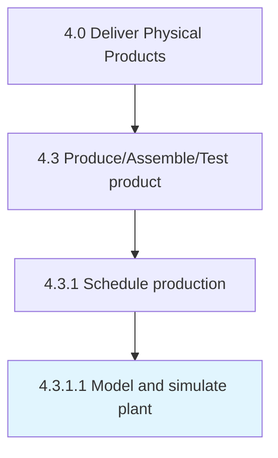

# Model and simulate plant

> Creating a representation of plant facilities to optimize material flow, resource utilization, and logistics for all levels of plant planning from global production facilities, through local plants, to specific lines and enabling the comparison of production�alternatives,.

## Overview

Activity 4.3.1.1 is an activity within the Deliver Physical Products framework. 

Creating a representation of plant facilities to optimize material flow, resource utilization, and logistics for all levels of plant planning from global production facilities, through local plants, to specific lines and enabling the comparison of production�alternatives,.

## Process Hierarchy



## Key Statistics

| Metric | Value |
|--------|-------|
| APQC Code | 19563 |
| Hierarchy ID | 4.3.1.1 |
| Level | Activity |
| Parent | [4.3.1](../) |
| Sub-Processes | 0 |


## GraphDL Semantic Structure

```
model.AndSimulatePlant
```

| Component | Value | Description |
|-----------|-------|-------------|
| Verb | `model` | Primary action |
| Object | `and simulate plant` | Direct object |


## Related Concepts

- Plant
- Plant


---

*Source: APQC PCF 19563 (4.3.1.1) - APQC*
