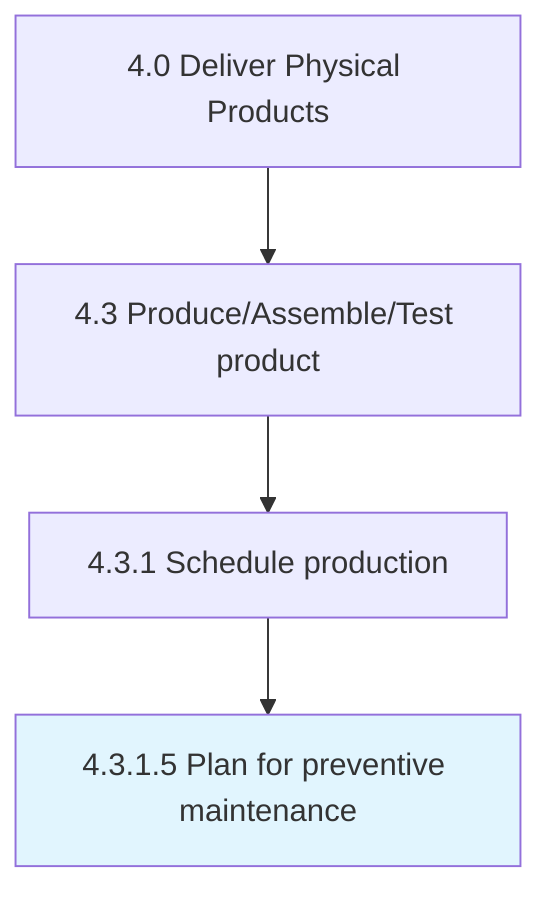

# Plan for preventive maintenance

> Scheduling planned maintenance of the production equipment.

## Overview

Activity 4.3.1.5 is an activity within the Deliver Physical Products framework. 

Scheduling planned maintenance of the production equipment.

## Process Hierarchy



## Key Statistics

| Metric | Value |
|--------|-------|
| APQC Code | 10315 |
| Hierarchy ID | 4.3.1.5 |
| Level | Activity |
| Parent | [4.3.1](../) |
| Sub-Processes | 0 |


## GraphDL Semantic Structure

```
plan.ForPreventiveMaintenance
```

| Component | Value | Description |
|-----------|-------|-------------|
| Verb | `plan` | Primary action |
| Object | `for preventive maintenance` | Direct object |


## Related Concepts

- [PreventiveMaintenance](/concepts/PreventiveMaintenance)


---

*Source: APQC PCF 10315 (4.3.1.5) - APQC*
