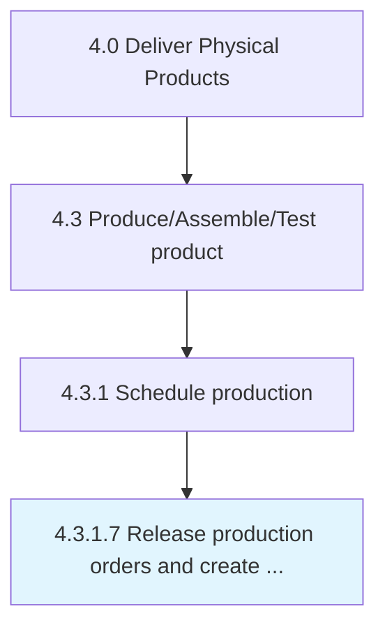

# Release production orders and create lots

> Initiating the delivery of production orders, and creating lots.

## Overview

Activity 4.3.1.7 is an activity within the Deliver Physical Products framework. 

Initiating the delivery of production orders, and creating lots. Communicate the order that specifies which material to produce, where to produce it, which operations to require, and on which date production takes place. Define how to settle the order costs. Create production lots, which is a particular production unit of an assembly that is planned and manufactured.

## Process Hierarchy



## Key Statistics

| Metric | Value |
|--------|-------|
| APQC Code | 10309 |
| Hierarchy ID | 4.3.1.7 |
| Level | Activity |
| Parent | [4.3.1](../) |
| Sub-Processes | 0 |


## GraphDL Semantic Structure

```
release.ProductionOrdersAndCreateLots
```

| Component | Value | Description |
|-----------|-------|-------------|
| Verb | `release` | Primary action |
| Object | `production orders and create lots` | Direct object |


## Related Concepts

- ProductionOrders
- CreateLots


---

*Source: APQC PCF 10309 (4.3.1.7) - APQC*
