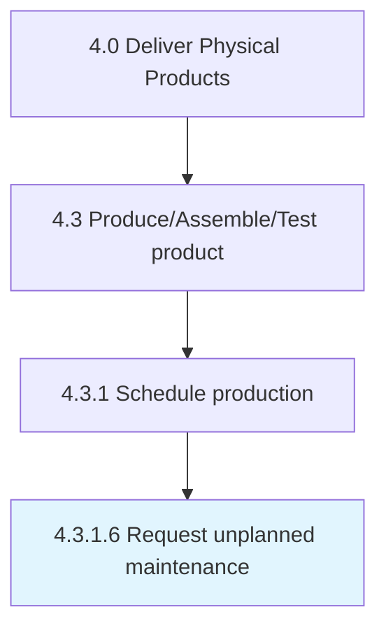

# Request unplanned maintenance

> Scheduling requested maintenance in order to address breakdowns where repairs or corrective remedies are needed immediately.

## Overview

Activity 4.3.1.6 is an activity within the Deliver Physical Products framework. 

Scheduling requested maintenance in order to address breakdowns where repairs or corrective remedies are needed immediately. Create a scheme for undertaking unplanned maintenance work on equipment/machinery that has come to be in urgent need for it. Express turnaround to redress using specialized personnel.

## Process Hierarchy



## Key Statistics

| Metric | Value |
|--------|-------|
| APQC Code | 10316 |
| Hierarchy ID | 4.3.1.6 |
| Level | Activity |
| Parent | [4.3.1](../) |
| Sub-Processes | 0 |


## GraphDL Semantic Structure

```
request.UnplannedMaintenance
```

| Component | Value | Description |
|-----------|-------|-------------|
| Verb | `request` | Primary action |
| Object | `unplanned maintenance` | Direct object |


## Related Concepts

- [UnplannedMaintenance](/concepts/UnplannedMaintenance)


---

*Source: APQC PCF 10316 (4.3.1.6) - APQC*
