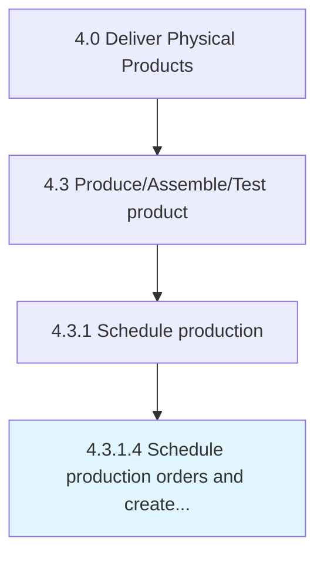

# Schedule production orders and create lots

> Creating a schedule to commence production of orders received, and creating lots to consolidate the processing.

## Overview

Activity 4.3.1.4 is an activity within the Deliver Physical Products framework. 

Creating a schedule to commence production of orders received, and creating lots to consolidate the processing. Plan when the production orders are to be initiated by commencing the operations for processing products/services. Specify which materials to produce, where to produce them, which operations will facilitate this, and on which date production is to start. Define the size of production lots, demarcating the durations of batch production.

## Process Hierarchy



## Key Statistics

| Metric | Value |
|--------|-------|
| APQC Code | 10308 |
| Hierarchy ID | 4.3.1.4 |
| Level | Activity |
| Parent | [4.3.1](../) |
| Sub-Processes | 0 |


## GraphDL Semantic Structure

```
schedule.ProductionOrdersAndCreateLots
```

| Component | Value | Description |
|-----------|-------|-------------|
| Verb | `schedule` | Primary action |
| Object | `production orders and create lots` | Direct object |


## Related Concepts

- ProductionOrders
- CreateLots


---

*Source: APQC PCF 10308 (4.3.1.4) - APQC*
