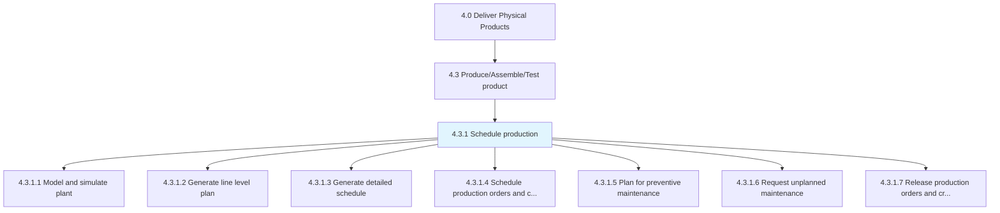
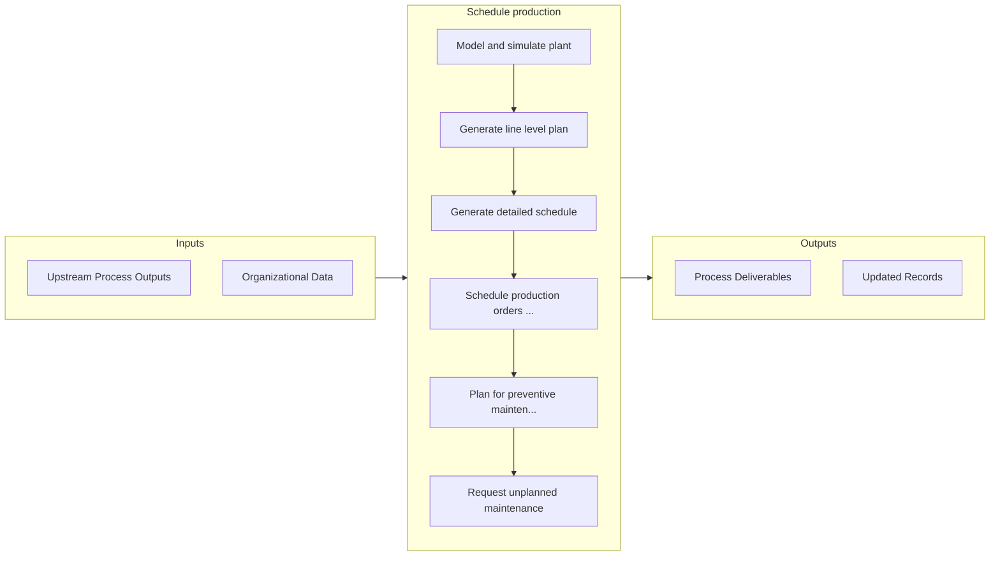

# Schedule production

> Scheduling the production of final products.

## Overview

Process 4.3.1 is a core process that defines the specific procedures for schedule production. 

Scheduling the production of final products. Generate a detailed schedule plan. Create and release production orders and lots. Schedule the planned and unplanned maintenance orders.

## Process Hierarchy



## Key Statistics

| Metric | Value |
|--------|-------|
| APQC Code | 10303 |
| Hierarchy ID | 4.3.1 |
| Level | Process |
| Parent | [4.3](../) |
| Sub-Processes | 7 |


## GraphDL Semantic Structure

```graphdl
schedule.Production
```

| Component | Value | Description |
|-----------|-------|-------------|
| Verb | `schedule` | Primary action |
| Object | `production` | Direct object |


## Process Flow



## Sub-Processes

| Process | Hierarchy ID | Description |
|---------|-------------|-------------|
| [Model and simulate plant](./ModelAndSimulatePlant) | 4.3.1.1 | Creating a representation of plant facilities to optimize material flow, resource utilization, and l |
| [Generate line level plan](./GenerateLineLevelPlan) | 4.3.1.2 | Initiating the line-level plan for production |
| [Generate detailed schedule](./GenerateDetailedSchedule) | 4.3.1.3 | Broadening the line-level plan |
| [Schedule production orders and create lots](./ScheduleProductionOrdersAndCreateLots) | 4.3.1.4 | Creating a schedule to commence production of orders received, and creating lots to consolidate the  |
| [Plan for preventive maintenance](./PlanForPreventiveMaintenance) | 4.3.1.5 | Scheduling planned maintenance of the production equipment |
| [Request unplanned maintenance](./RequestUnplannedMaintenance) | 4.3.1.6 | Scheduling requested maintenance in order to address breakdowns where repairs or corrective remedies |
| [Release production orders and create lots](./ReleaseProductionOrdersAndCreateLots) | 4.3.1.7 | Initiating the delivery of production orders, and creating lots |


## Related Concepts

- Production


---

*Source: APQC PCF 10303 (4.3.1) - APQC*
