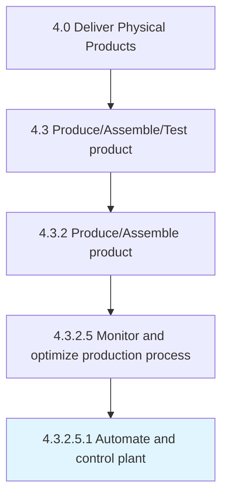

# Automate and control plant

> Creating and applying technology to monitor and control the production and delivery of products and services.

## Overview

Sub-Activity 4.3.2.5.1 is an activity within the Deliver Physical Products framework. 

Creating and applying technology to monitor and control the production and delivery of products and services. Automation involves a broad range of technologies.

## Process Hierarchy



## Key Statistics

| Metric | Value |
|--------|-------|
| APQC Code | 19567 |
| Hierarchy ID | 4.3.2.5.1 |
| Level | Sub-Activity |
| Parent | [4.3.2.5](../) |
| Sub-Processes | 0 |


## GraphDL Semantic Structure

```
automate.AndControlPlant
```

| Component | Value | Description |
|-----------|-------|-------------|
| Verb | `automate` | Primary action |
| Object | `and control plant` | Direct object |


## Related Concepts

- Plant
- Plant


---

*Source: APQC PCF 19567 (4.3.2.5.1) - APQC*
