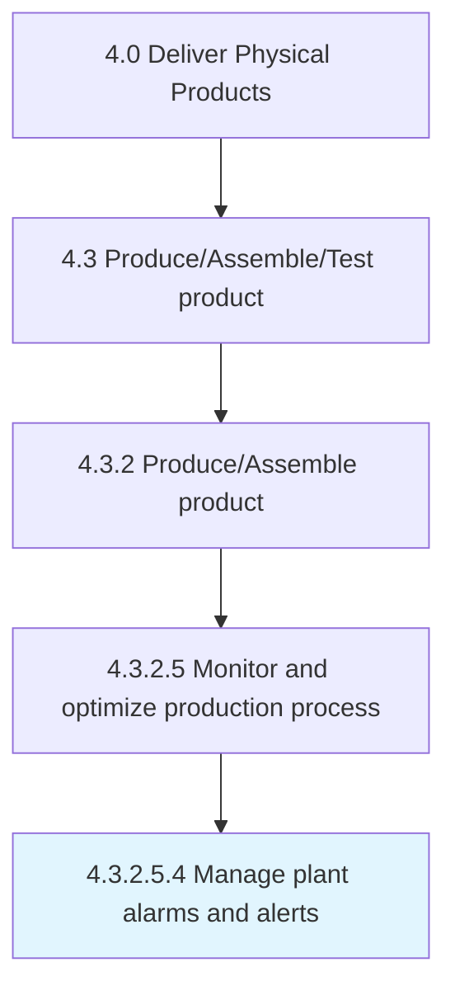

# Manage plant alarms and alerts

> Applying human factors and instrumentation engineering and systems thinking to manage the design of an alarm or alert system to increase its usability.

## Overview

Sub-Activity 4.3.2.5.4 is an activity within the Deliver Physical Products framework. 

Applying human factors and instrumentation engineering and systems thinking to manage the design of an alarm or alert system to increase its usability. Typical challenges include having too many alarms in a plant, poorly designed alarms/alerts, improperly set alarm/alert points, unclear alarm/alert messages, etc. Poor alarm management is one of the leading causes of unplanned downtime.

## Process Hierarchy



## Key Statistics

| Metric | Value |
|--------|-------|
| APQC Code | 19570 |
| Hierarchy ID | 4.3.2.5.4 |
| Level | Sub-Activity |
| Parent | [4.3.2.5](../) |
| Sub-Processes | 0 |


## GraphDL Semantic Structure

```
manage.PlantAlarmsAndAlerts
```

| Component | Value | Description |
|-----------|-------|-------------|
| Verb | `manage` | Primary action |
| Object | `plant alarms and alerts` | Direct object |


## Related Concepts

- [PlantAlarms](/concepts/PlantAlarms)
- [Alerts](/concepts/Alerts)


---

*Source: APQC PCF 19570 (4.3.2.5.4) - APQC*
