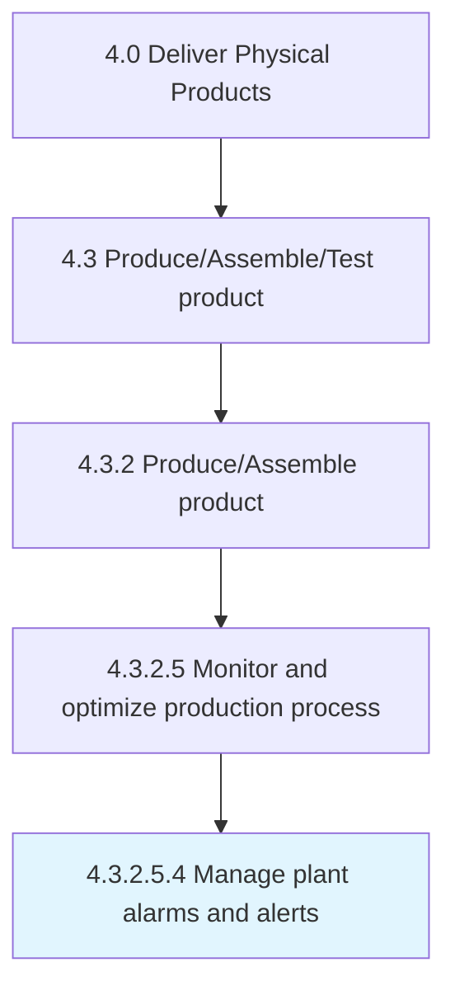
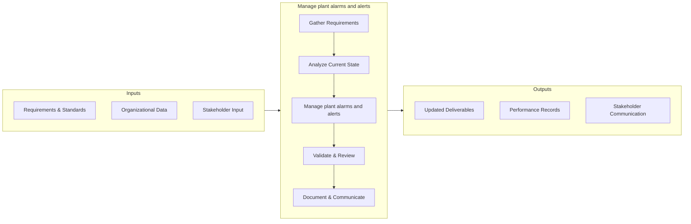

# Manage plant alarms and alerts

> Applying human factors and instrumentation engineering and systems thinking to manage the design of an alarm or alert system to increase its usability.

## Overview

This activity encompasses the end-to-end process of manage plant alarms and alerts within the supply chain and physical product delivery domain. It involves coordinating cross-functional teams, applying standardized methodologies, and leveraging organizational data to ensure consistent and effective outcomes. The process is aligned with the broader Deliver Physical Products framework (APQC 4.3.2.5.4) and supports strategic objectives by translating operational requirements into actionable procedures.

Effective execution of this activity requires clear ownership, well-defined inputs and outputs, and continuous monitoring against established benchmarks. Organizations that excel at this process typically integrate it with upstream planning activities and downstream performance measurement, creating a feedback loop that drives ongoing improvement and adaptation to changing business conditions.


## Process Hierarchy



## Key Statistics

| Metric | Value |
|--------|-------|
| APQC Code | 19570 |
| Hierarchy ID | 4.3.2.5.4 |
| Level | Sub-Activity |
| Parent | [4.3.2.5](../) |
| Sub-Processes | 0 |


## GraphDL Semantic Structure

```graphdl
manage.PlantAlarmsAndAlerts
```

| Component | Value | Description |
|-----------|-------|-------------|
| Verb | `manage` | Primary action |
| Object | `plant alarms and alerts` | Direct object |


## Process Flow



## RACI Matrix

| Activity | Production Manager | Supply Chain Director | Quality Assurance Team | Finance Department |
|----------|:-:|:-:|:-:|:-:|
| Gather Requirements | R | A | C | I |
| Analyze Current State | R | I | C | I |
| Manage plant alarms and alerts | R | A | C | I |
| Validate & Review | C | A | R | I |
| Document & Communicate | R | I | I | C |

## Related Occupations

- [Supply Chain Manager](/occupations/Management/SupplyChainManagers)
- [Logistics Analyst](/occupations/Business/LogisticsAnalysts)
- [Production Manager](/occupations/ProductionManagers)
- [Warehouse Manager](/occupations/WarehouseManagers)

## Related Departments

- Supply Chain & Logistics
- Manufacturing & Production
- Quality Assurance

## Industry Variations

### Manufacturing
Emphasis on lean production, JIT inventory, and continuous improvement methodologies such as Six Sigma and Kaizen.

### Retail
Focus on omnichannel fulfillment, last-mile delivery optimization, and seasonal demand management.

### Automotive
Integration of complex multi-tier supplier networks with assembly line synchronization and recall management.

## KPIs & Metrics

| KPI | Description | Unit |
|-----|-------------|------|
| Cycle Time | Average time to complete manage plant alarms and alerts process | Hours/Days |
| Completion Rate | Percentage of plant alarms and alerts activities completed on schedule | % |
| Quality Score | Accuracy and quality rating of plant alarms and alerts outputs | 1-10 Scale |
| Cost Efficiency | Cost per unit of plant alarms and alerts processed | $/Unit |
| On-Time Delivery | Percentage of deliverables completed within target timeline | % |

## Related Concepts

- PlantAlarms
- Alerts


---

*Source: APQC PCF 19570 (4.3.2.5.4) - APQC*
