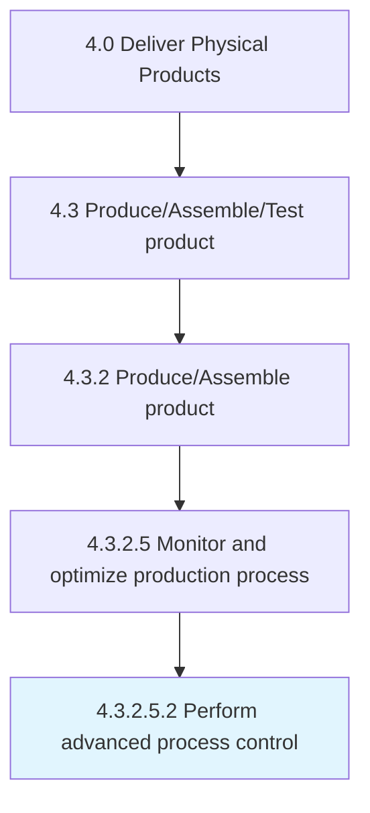

# Perform advanced process control

> Including a broad range of techniques and technologies implemented within industrial process control systems that are routinely reviewed, audited, and improved, advanced process controls typically address particular performance or economic improvement opportunities.

## Overview

Sub-Activity 4.3.2.5.2 is an activity within the Deliver Physical Products framework. 

Including a broad range of techniques and technologies implemented within industrial process control systems that are routinely reviewed, audited, and improved, advanced process controls typically address particular performance or economic improvement opportunities. An advanced set of process control measures can be used to reduce variation and identify primary improvement options. Results of analysis are fed back into process design for incorporation into production.

## Process Hierarchy



## Key Statistics

| Metric | Value |
|--------|-------|
| APQC Code | 19568 |
| Hierarchy ID | 4.3.2.5.2 |
| Level | Sub-Activity |
| Parent | [4.3.2.5](../) |
| Sub-Processes | 0 |


## GraphDL Semantic Structure

```
perform.AdvancedProcessControl
```

| Component | Value | Description |
|-----------|-------|-------------|
| Verb | `perform` | Primary action |
| Object | `advanced process control` | Direct object |


## Related Concepts

- AdvancedProcessControl


---

*Source: APQC PCF 19568 (4.3.2.5.2) - APQC*
