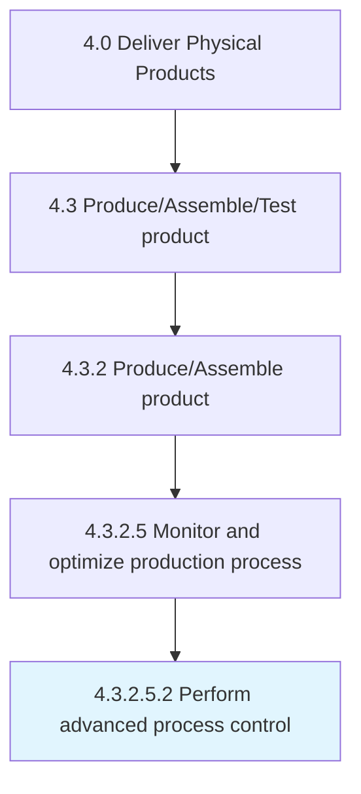
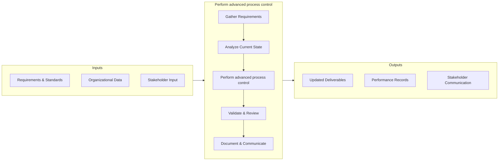

# Perform advanced process control

> Including a broad range of techniques and technologies implemented within industrial process control systems that are routinely reviewed, audited, and improved, advanced process controls typically address particular performance or economic improvement opportunities.

## Overview

Sub-Activity 4.3.2.5.2 is an activity within the Deliver Physical Products framework. 

Including a broad range of techniques and technologies implemented within industrial process control systems that are routinely reviewed, audited, and improved, advanced process controls typically address particular performance or economic improvement opportunities. An advanced set of process control measures can be used to reduce variation and identify primary improvement options. Results of analysis are fed back into process design for incorporation into production.

## Process Hierarchy



## Key Statistics

| Metric | Value |
|--------|-------|
| APQC Code | 19568 |
| Hierarchy ID | 4.3.2.5.2 |
| Level | Sub-Activity |
| Parent | [4.3.2.5](../) |
| Sub-Processes | 0 |


## GraphDL Semantic Structure

```
perform.AdvancedProcessControl
```

| Component | Value | Description |
|-----------|-------|-------------|
| Verb | `perform` | Primary action |
| Object | `advanced process control` | Direct object |


## Process Flow



## RACI Matrix

| Activity | Production Manager | Supply Chain Director | Quality Assurance Team | Finance Department |
|----------|:-:|:-:|:-:|:-:|
| Gather Requirements | R | A | C | I |
| Analyze Current State | R | I | C | I |
| Perform advanced process control | R | A | C | I |
| Validate & Review | C | A | R | I |
| Document & Communicate | R | I | I | C |

## Related Occupations

- [Supply Chain Manager](/occupations/SupplyChainManagers)
- [Logistics Analyst](/occupations/LogisticsAnalysts)
- [Production Manager](/occupations/ProductionManagers)
- [Warehouse Manager](/occupations/WarehouseManagers)

## Related Departments

- Supply Chain & Logistics
- Manufacturing & Production
- Quality Assurance

## Industry Variations

### Manufacturing
Emphasis on lean production, JIT inventory, and continuous improvement methodologies such as Six Sigma and Kaizen.

### Retail
Focus on omnichannel fulfillment, last-mile delivery optimization, and seasonal demand management.

### Automotive
Integration of complex multi-tier supplier networks with assembly line synchronization and recall management.

## KPIs & Metrics

| KPI | Description | Unit |
|-----|-------------|------|
| Cycle Time | Average time to complete perform advanced process control process | Hours/Days |
| Completion Rate | Percentage of advanced process control activities completed on schedule | % |
| Quality Score | Accuracy and quality rating of advanced process control outputs | 1-10 Scale |
| Cost Efficiency | Cost per unit of advanced process control processed | $/Unit |
| On-Time Delivery | Percentage of deliverables completed within target timeline | % |

## Related Concepts

- AdvancedProcessControl


---

*Source: APQC PCF 19568 (4.3.2.5.2) - APQC*
