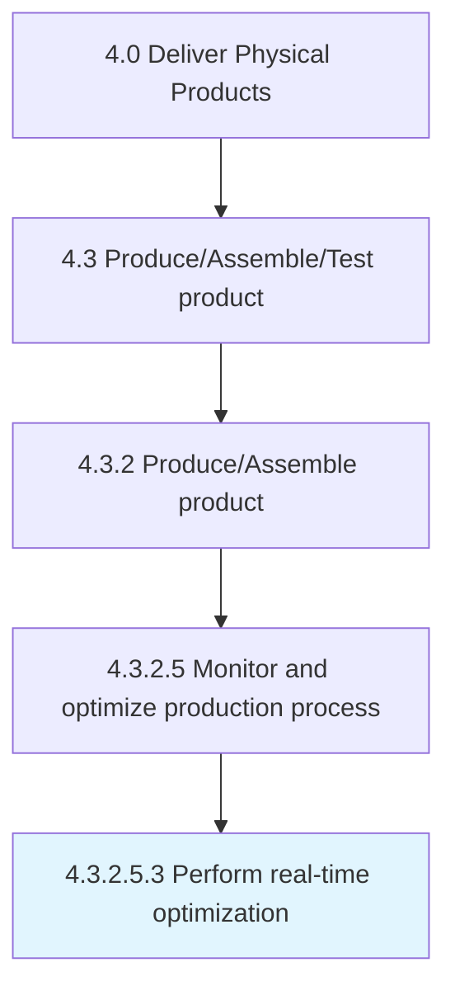
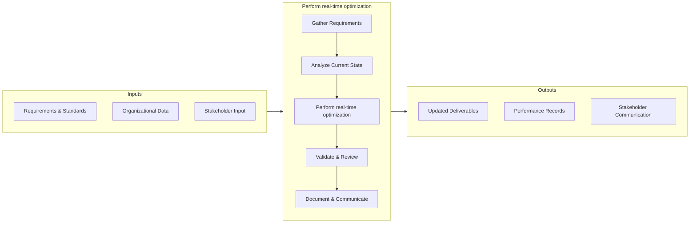

# Perform real-time optimization

> Helping organizations increase performance and efficiency, real-time optimization is a category of closed-loop process control that aims at optimizing process performance in real time for systems.

## Overview

Sub-Activity 4.3.2.5.3 is an activity within the Deliver Physical Products framework. 

Helping organizations increase performance and efficiency, real-time optimization is a category of closed-loop process control that aims at optimizing process performance in real time for systems. It is normally built upon model-based optimization systems and is usually large scale. Real-time optimization automatically detects errors, and can modify and eliminate both random and non-random errors, as well as analyze and monitor all systems involved.

## Process Hierarchy



## Key Statistics

| Metric | Value |
|--------|-------|
| APQC Code | 19569 |
| Hierarchy ID | 4.3.2.5.3 |
| Level | Sub-Activity |
| Parent | [4.3.2.5](../) |
| Sub-Processes | 0 |


## GraphDL Semantic Structure

```graphdl
perform.RealtimeOptimization
```

| Component | Value | Description |
|-----------|-------|-------------|
| Verb | `perform` | Primary action |
| Object | `real-time optimization` | Direct object |


## Process Flow



## RACI Matrix

| Activity | Production Manager | Supply Chain Director | Quality Assurance Team | Finance Department |
|----------|:-:|:-:|:-:|:-:|
| Gather Requirements | R | A | C | I |
| Analyze Current State | R | I | C | I |
| Perform real-time optimization | R | A | C | I |
| Validate & Review | C | A | R | I |
| Document & Communicate | R | I | I | C |

## Related Occupations

- [Supply Chain Manager](/occupations/Management/SupplyChainManagers)
- [Logistics Analyst](/occupations/Business/LogisticsAnalysts)
- [Production Manager](/occupations/ProductionManagers)
- [Warehouse Manager](/occupations/WarehouseManagers)

## Related Departments

- Supply Chain & Logistics
- Manufacturing & Production
- Quality Assurance

## Industry Variations

### Manufacturing
Emphasis on lean production, JIT inventory, and continuous improvement methodologies such as Six Sigma and Kaizen.

### Retail
Focus on omnichannel fulfillment, last-mile delivery optimization, and seasonal demand management.

### Automotive
Integration of complex multi-tier supplier networks with assembly line synchronization and recall management.

## KPIs & Metrics

| KPI | Description | Unit |
|-----|-------------|------|
| Cycle Time | Average time to complete perform real-time optimization process | Hours/Days |
| Completion Rate | Percentage of real-time optimization activities completed on schedule | % |
| Quality Score | Accuracy and quality rating of real-time optimization outputs | 1-10 Scale |
| Cost Efficiency | Cost per unit of real-time optimization processed | $/Unit |
| Stakeholder Satisfaction | Rating of process outcomes by key stakeholders | 1-5 Scale |

---

*Source: APQC PCF 19569 (4.3.2.5.3) - APQC*
