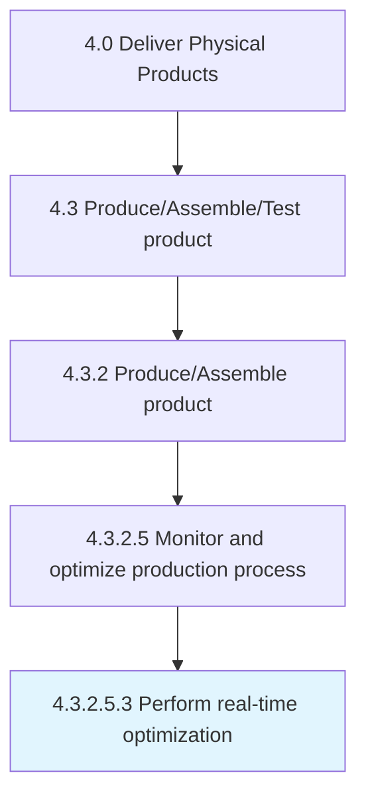

# Perform real-time optimization

> Helping organizations increase performance and efficiency, real-time optimization is a category of closed-loop process control that aims at optimizing process performance in real time for systems.

## Overview

Sub-Activity 4.3.2.5.3 is an activity within the Deliver Physical Products framework. 

Helping organizations increase performance and efficiency, real-time optimization is a category of closed-loop process control that aims at optimizing process performance in real time for systems. It is normally built upon model-based optimization systems and is usually large scale. Real-time optimization automatically detects errors, and can modify and eliminate both random and non-random errors, as well as analyze and monitor all systems involved.

## Process Hierarchy



## Key Statistics

| Metric | Value |
|--------|-------|
| APQC Code | 19569 |
| Hierarchy ID | 4.3.2.5.3 |
| Level | Sub-Activity |
| Parent | [4.3.2.5](../) |
| Sub-Processes | 0 |


## GraphDL Semantic Structure

```
perform.RealtimeOptimization
```

| Component | Value | Description |
|-----------|-------|-------------|
| Verb | `perform` | Primary action |
| Object | `real-time optimization` | Direct object |


---

*Source: APQC PCF 19569 (4.3.2.5.3) - APQC*
