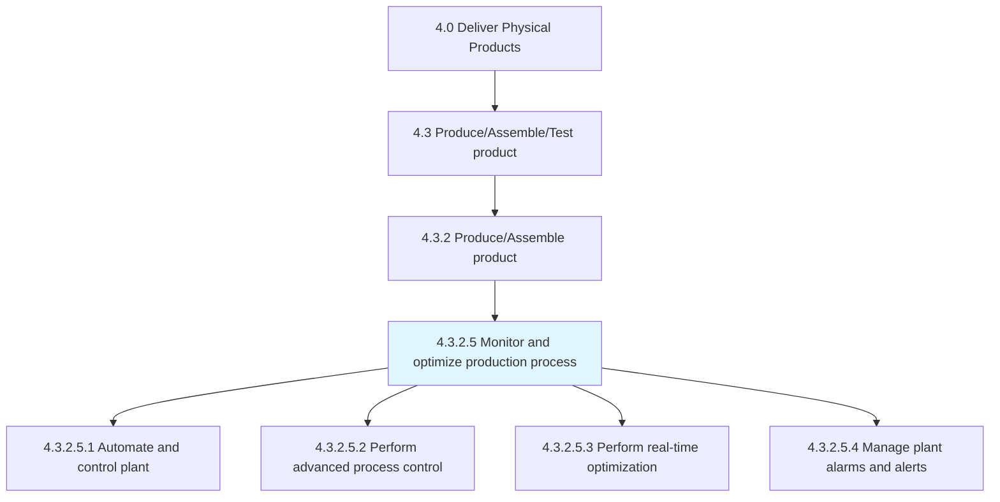
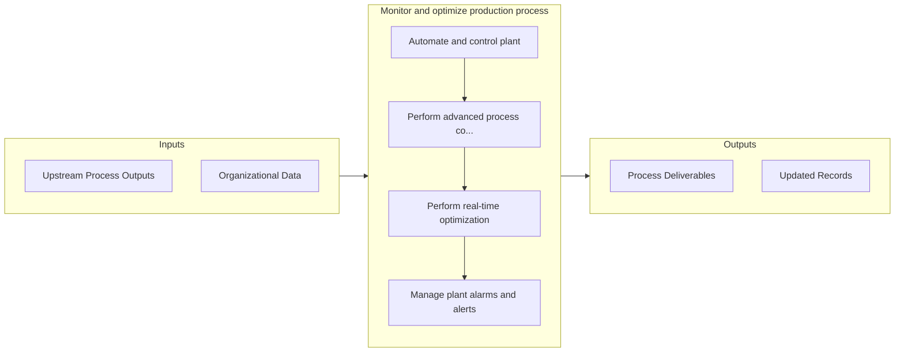

# Monitor and optimize production process

> Integrating different resources in the production process: material, personnel, equipment, robotics, etc.

## Overview

Activity 4.3.2.5 is an activity within the Deliver Physical Products framework. 

Integrating different resources in the production process: material, personnel, equipment, robotics, etc. Includes automating and controlling the plant, performing advanced process control and real-time optimization. This activity also includes managing plant alarms and alerts.

## Process Hierarchy



## Key Statistics

| Metric | Value |
|--------|-------|
| APQC Code | 19566 |
| Hierarchy ID | 4.3.2.5 |
| Level | Activity |
| Parent | [4.3.2](../) |
| Sub-Processes | 4 |


## GraphDL Semantic Structure

```graphdl
monitor.AndOptimizeProductionProcess
```

| Component | Value | Description |
|-----------|-------|-------------|
| Verb | `monitor` | Primary action |
| Object | `and optimize production process` | Direct object |


## Process Flow



## Sub-Processes

| Process | Hierarchy ID | Description |
|---------|-------------|-------------|
| [Automate and control plant](./AutomateAndControlPlant) | 4.3.2.5.1 | Creating and applying technology to monitor and control the production and delivery of products and  |
| [Perform advanced process control](./PerformAdvancedProcessControl) | 4.3.2.5.2 | Including a broad range of techniques and technologies implemented within industrial process control |
| [Perform real-time optimization](./PerformRealtimeOptimization) | 4.3.2.5.3 | Helping organizations increase performance and efficiency, real-time optimization is a category of c |
| [Manage plant alarms and alerts](./ManagePlantAlarmsAndAlerts) | 4.3.2.5.4 | Applying human factors and instrumentation engineering and systems thinking to manage the design of  |


## Related Concepts

- ProductionProcess
- ProductionProcess


---

*Source: APQC PCF 19566 (4.3.2.5) - APQC*
