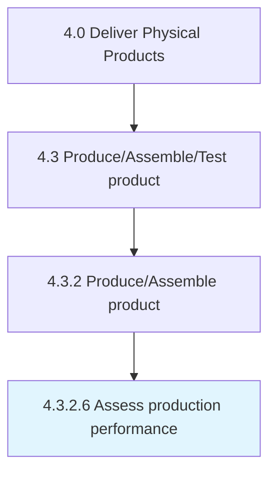

# Assess production performance

> Analyzing and benchmarking the production process to judge its effectiveness and efficiency.

## Overview

Activity 4.3.2.6 is an activity within the Deliver Physical Products framework. 

Analyzing and benchmarking the production process to judge its effectiveness and efficiency. Create production metrics to numerically calculate the performance of the production process.

## Process Hierarchy



## Key Statistics

| Metric | Value |
|--------|-------|
| APQC Code | 10314 |
| Hierarchy ID | 4.3.2.6 |
| Level | Activity |
| Parent | [4.3.2](../) |
| Sub-Processes | 0 |


## GraphDL Semantic Structure

```
assess.ProductionPerformance
```

| Component | Value | Description |
|-----------|-------|-------------|
| Verb | `assess` | Primary action |
| Object | `production performance` | Direct object |


## Related Concepts

- [ProductionPerformance](/concepts/ProductionPerformance)


---

*Source: APQC PCF 10314 (4.3.2.6) - APQC*
