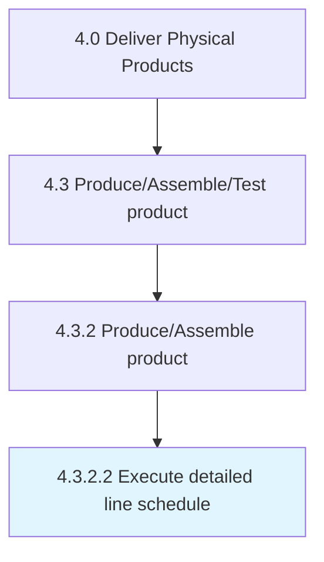

# Execute detailed line schedule

> Creating and implementing the detailed line production schedule on the ground level.

## Overview

Activity 4.3.2.2 is an activity within the Deliver Physical Products framework. 

Creating and implementing the detailed line production schedule on the ground level.

## Process Hierarchy



## Key Statistics

| Metric | Value |
|--------|-------|
| APQC Code | 10311 |
| Hierarchy ID | 4.3.2.2 |
| Level | Activity |
| Parent | [4.3.2](../) |
| Sub-Processes | 0 |


## GraphDL Semantic Structure

```
execute.DetailedLineSchedule
```

| Component | Value | Description |
|-----------|-------|-------------|
| Verb | `execute` | Primary action |
| Object | `detailed line schedule` | Direct object |


## Related Concepts

- DetailedLineSchedule


---

*Source: APQC PCF 10311 (4.3.2.2) - APQC*
