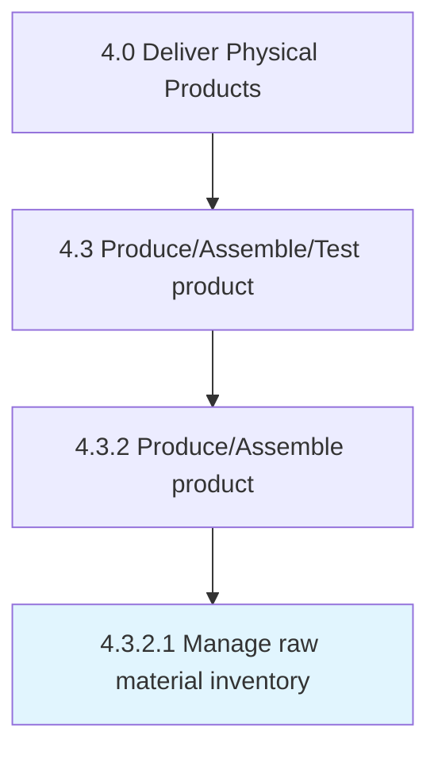

# Manage raw material inventory

> Administering the inventory of raw materials.

## Overview

Activity 4.3.2.1 is an activity within the Deliver Physical Products framework. 

Administering the inventory of raw materials. Manage the total cost of all component parts in stock but not yet used. Manage the cost of the direct materials (i.e., materials incorporated into the final product) and indirect materials (i.e., materials not incorporated into the final product but consumed during the production process).

## Process Hierarchy



## Key Statistics

| Metric | Value |
|--------|-------|
| APQC Code | 10310 |
| Hierarchy ID | 4.3.2.1 |
| Level | Activity |
| Parent | [4.3.2](../) |
| Sub-Processes | 0 |


## GraphDL Semantic Structure

```
manage.RawMaterialInventory
```

| Component | Value | Description |
|-----------|-------|-------------|
| Verb | `manage` | Primary action |
| Object | `raw material inventory` | Direct object |


## Related Concepts

- [RawMaterialInventory](/concepts/RawMaterialInventory)


---

*Source: APQC PCF 10310 (4.3.2.1) - APQC*
