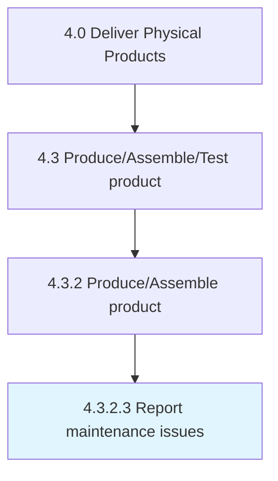

# Report maintenance issues

> Recording and reporting any deviations or issues in the maintenance schedule, in the performance to the production management team, and for unplanned maintenance.

## Overview

Activity 4.3.2.3 is an activity within the Deliver Physical Products framework. 

Recording and reporting any deviations or issues in the maintenance schedule, in the performance to the production management team, and for unplanned maintenance.

## Process Hierarchy



## Key Statistics

| Metric | Value |
|--------|-------|
| APQC Code | 10319 |
| Hierarchy ID | 4.3.2.3 |
| Level | Activity |
| Parent | [4.3.2](../) |
| Sub-Processes | 0 |


## GraphDL Semantic Structure

```
report.MaintenanceIssues
```

| Component | Value | Description |
|-----------|-------|-------------|
| Verb | `report` | Primary action |
| Object | `maintenance issues` | Direct object |


## Related Concepts

- [MaintenanceIssues](/concepts/MaintenanceIssues)


---

*Source: APQC PCF 10319 (4.3.2.3) - APQC*
