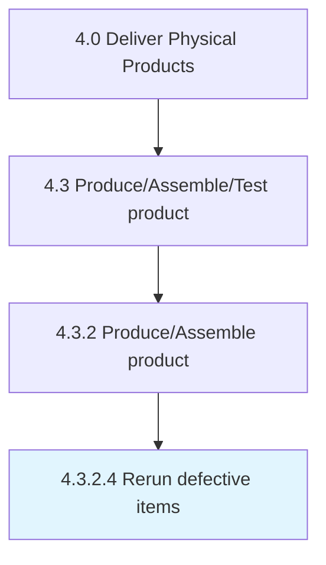

# Rerun defective items

> Reproducing the items produced defectively.

## Overview

Activity 4.3.2.4 is an activity within the Deliver Physical Products framework. 

Reproducing the items produced defectively. Assess the produced items by conducting quality and standardization tests in order to diagnose any discrepancies. Reproduce defective items.

## Process Hierarchy



## Key Statistics

| Metric | Value |
|--------|-------|
| APQC Code | 10313 |
| Hierarchy ID | 4.3.2.4 |
| Level | Activity |
| Parent | [4.3.2](../) |
| Sub-Processes | 0 |


## GraphDL Semantic Structure

```
rerun.DefectiveItems
```

| Component | Value | Description |
|-----------|-------|-------------|
| Verb | `rerun` | Primary action |
| Object | `defective items` | Direct object |


## Related Concepts

- DefectiveItems


---

*Source: APQC PCF 10313 (4.3.2.4) - APQC*
