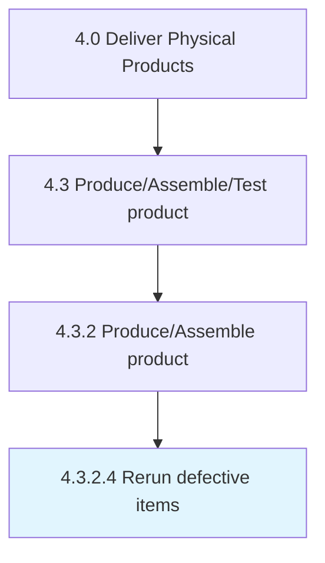
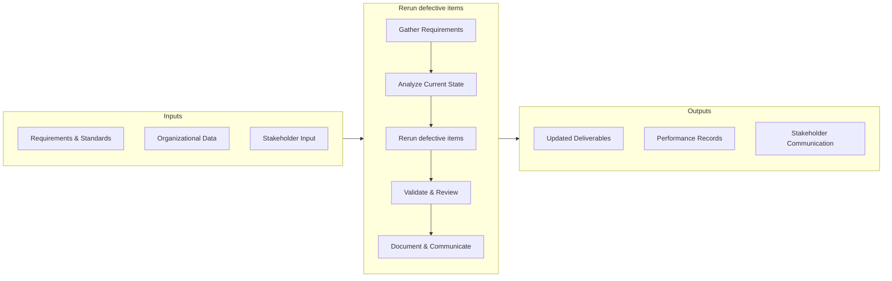

# Rerun defective items

> Reproducing the items produced defectively.

## Overview

This activity encompasses the end-to-end process of rerun defective items within the supply chain and physical product delivery domain. It involves coordinating cross-functional teams, applying standardized methodologies, and leveraging organizational data to ensure consistent and effective outcomes. The process is aligned with the broader Deliver Physical Products framework (APQC 4.3.2.4) and supports strategic objectives by translating operational requirements into actionable procedures.

Effective execution of this activity requires clear ownership, well-defined inputs and outputs, and continuous monitoring against established benchmarks. Organizations that excel at this process typically integrate it with upstream planning activities and downstream performance measurement, creating a feedback loop that drives ongoing improvement and adaptation to changing business conditions.


## Process Hierarchy



## Key Statistics

| Metric | Value |
|--------|-------|
| APQC Code | 10313 |
| Hierarchy ID | 4.3.2.4 |
| Level | Activity |
| Parent | [4.3.2](../) |
| Sub-Processes | 0 |


## GraphDL Semantic Structure

```
rerun.DefectiveItems
```

| Component | Value | Description |
|-----------|-------|-------------|
| Verb | `rerun` | Primary action |
| Object | `defective items` | Direct object |


## Process Flow



## RACI Matrix

| Activity | Production Manager | Supply Chain Director | Quality Assurance Team | Finance Department |
|----------|:-:|:-:|:-:|:-:|
| Gather Requirements | R | A | C | I |
| Analyze Current State | R | I | C | I |
| Rerun defective items | R | A | C | I |
| Validate & Review | C | A | R | I |
| Document & Communicate | R | I | I | C |

## Related Occupations

- [Supply Chain Manager](/occupations/SupplyChainManagers)
- [Logistics Analyst](/occupations/LogisticsAnalysts)
- [Production Manager](/occupations/ProductionManagers)
- [Warehouse Manager](/occupations/WarehouseManagers)

## Related Departments

- Supply Chain & Logistics
- Manufacturing & Production
- Quality Assurance

## Industry Variations

### Manufacturing
Emphasis on lean production, JIT inventory, and continuous improvement methodologies such as Six Sigma and Kaizen.

### Retail
Focus on omnichannel fulfillment, last-mile delivery optimization, and seasonal demand management.

### Automotive
Integration of complex multi-tier supplier networks with assembly line synchronization and recall management.

## KPIs & Metrics

| KPI | Description | Unit |
|-----|-------------|------|
| Cycle Time | Average time to complete rerun defective items process | Hours/Days |
| Completion Rate | Percentage of defective items activities completed on schedule | % |
| Quality Score | Accuracy and quality rating of defective items outputs | 1-10 Scale |
| Cost Efficiency | Cost per unit of defective items processed | $/Unit |
| On-Time Delivery | Percentage of deliverables completed within target timeline | % |

## Related Concepts

- DefectiveItems


---

*Source: APQC PCF 10313 (4.3.2.4) - APQC*
