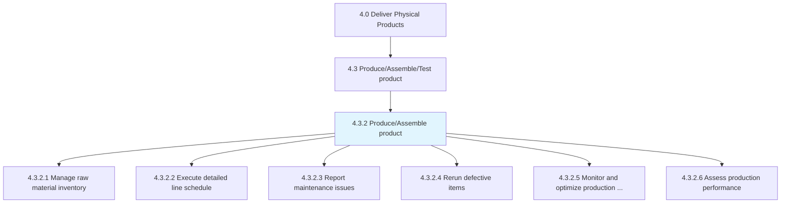
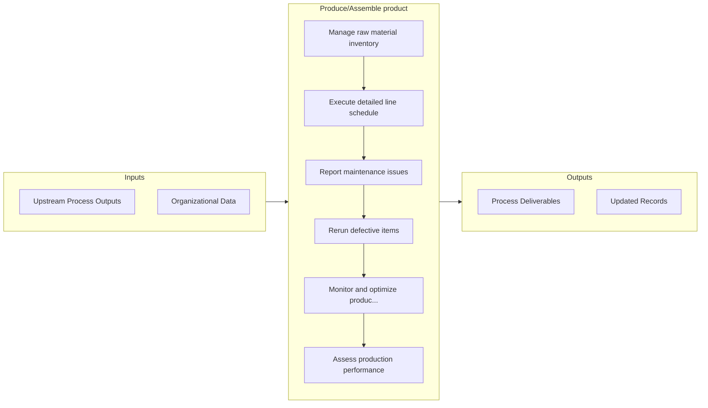

# Produce/Assemble product

> Manufacturing the product.

## Overview

Process 4.3.2 is a core process that defines the specific procedures for produce/assemble product. 

Manufacturing the product. Convert the raw materials to develop consumer-ready products. Manage the raw materials to implement the detailed production schedule. Reproduce defectives to establish and remediate cause. Ensure production optimization and benchmark performance.

## Process Hierarchy



## Key Statistics

| Metric | Value |
|--------|-------|
| APQC Code | 10304 |
| Hierarchy ID | 4.3.2 |
| Level | Process |
| Parent | [4.3](../) |
| Sub-Processes | 6 |


## GraphDL Semantic Structure

```graphdl
produce/assemble.Product
```

| Component | Value | Description |
|-----------|-------|-------------|
| Verb | `produce/assemble` | Primary action |
| Object | `product` | Direct object |


## Process Flow



## Sub-Processes

| Process | Hierarchy ID | Description |
|---------|-------------|-------------|
| [Manage raw material inventory](./ManageRawMaterialInventory) | 4.3.2.1 | Administering the inventory of raw materials |
| [Execute detailed line schedule](./ExecuteDetailedLineSchedule) | 4.3.2.2 | Creating and implementing the detailed line production schedule on the ground level |
| [Report maintenance issues](./ReportMaintenanceIssues) | 4.3.2.3 | Recording and reporting any deviations or issues in the maintenance schedule, in the performance to  |
| [Rerun defective items](./RerunDefectiveItems) | 4.3.2.4 | Reproducing the items produced defectively |
| [Monitor and optimize production process](./4.3.2.5-MonitorOptimizeProductionProcess/) | 4.3.2.5 | Integrating different resources in the production process: material, personnel, equipment, robotics, |
| [Assess production performance](./AssessProductionPerformance) | 4.3.2.6 | Analyzing and benchmarking the production process to judge its effectiveness and efficiency |


## Related Concepts

- Product
- Product


---

*Source: APQC PCF 10304 (4.3.2) - APQC*
