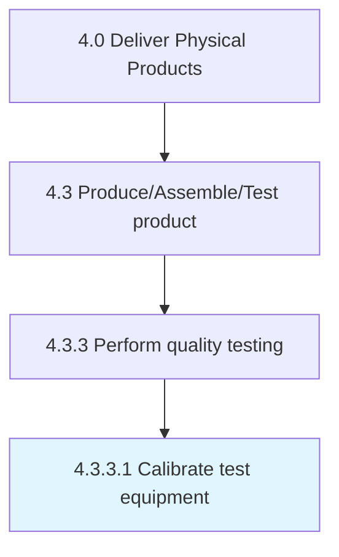

# Calibrate test equipment

> Regulating the equipment used for performing quality tests.

## Overview

Activity 4.3.3.1 is an activity within the Deliver Physical Products framework. 

Regulating the equipment used for performing quality tests. Assess correspondence between the quality testing equipment and the desired quality standards. Ensure the calibration standard is more accurate than the instrument being tested.

## Process Hierarchy



## Key Statistics

| Metric | Value |
|--------|-------|
| APQC Code | 10318 |
| Hierarchy ID | 4.3.3.1 |
| Level | Activity |
| Parent | [4.3.3](../) |
| Sub-Processes | 0 |


## GraphDL Semantic Structure

```
calibrate.TestEquipment
```

| Component | Value | Description |
|-----------|-------|-------------|
| Verb | `calibrate` | Primary action |
| Object | `test equipment` | Direct object |


## Related Concepts

- [TestEquipment](/concepts/TestEquipment)


---

*Source: APQC PCF 10318 (4.3.3.1) - APQC*
