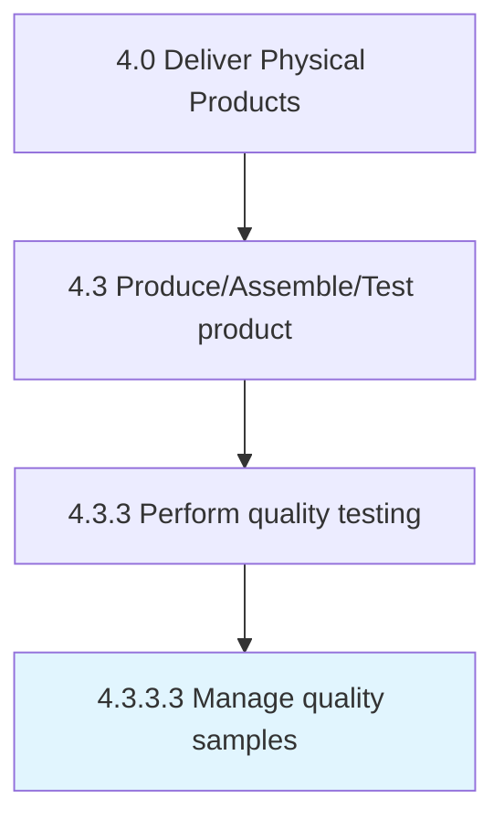

# Manage quality samples

> Selecting a set of elements from a product lot to draw conclusions or make inferences about the quality of the product lot from which the sample is drawn.

## Overview

Activity 4.3.3.3 is an activity within the Deliver Physical Products framework. 

Selecting a set of elements from a product lot to draw conclusions or make inferences about the quality of the product lot from which the sample is drawn. Sampling is frequently used because gathering data on every product produced by a company is often impossible, impractical, or too costly to collect.

## Process Hierarchy



## Key Statistics

| Metric | Value |
|--------|-------|
| APQC Code | 20956 |
| Hierarchy ID | 4.3.3.3 |
| Level | Activity |
| Parent | [4.3.3](../) |
| Sub-Processes | 0 |


## GraphDL Semantic Structure

```
manage.QualitySamples
```

| Component | Value | Description |
|-----------|-------|-------------|
| Verb | `manage` | Primary action |
| Object | `quality samples` | Direct object |


## Related Concepts

- QualitySamples


---

*Source: APQC PCF 20956 (4.3.3.3) - APQC*
