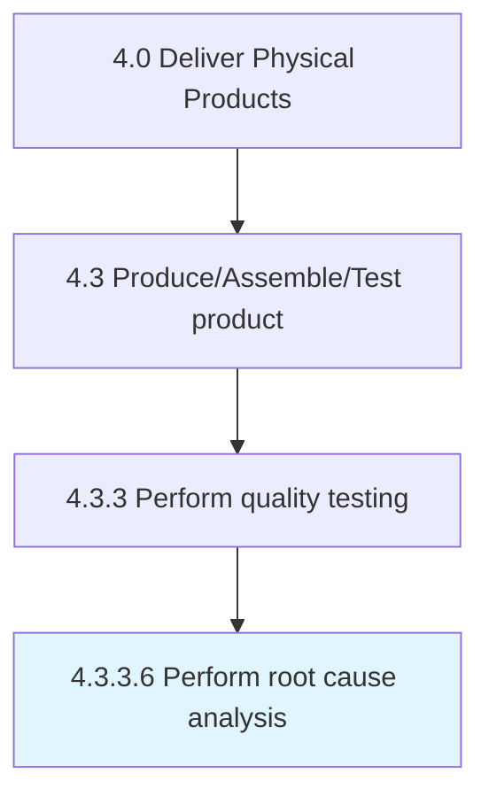

# Perform root cause analysis

> Using a technique that helps people answer the question of why a problem occurred in the first place.

## Overview

Activity 4.3.3.6 is an activity within the Deliver Physical Products framework. 

Using a technique that helps people answer the question of why a problem occurred in the first place. It seeks to identify the origin of a problem using a specific set of steps, with associated tools, to find the primary cause of the problem to determine what happened, why, and how to reduce the likelihood that it will happen again.

## Process Hierarchy



## Key Statistics

| Metric | Value |
|--------|-------|
| APQC Code | 12046 |
| Hierarchy ID | 4.3.3.6 |
| Level | Activity |
| Parent | [4.3.3](../) |
| Sub-Processes | 0 |


## GraphDL Semantic Structure

```
perform.RootCauseAnalysis
```

| Component | Value | Description |
|-----------|-------|-------------|
| Verb | `perform` | Primary action |
| Object | `root cause analysis` | Direct object |


## Related Concepts

- [RootCauseAnalysis](/concepts/RootCauseAnalysis)


---

*Source: APQC PCF 12046 (4.3.3.6) - APQC*
