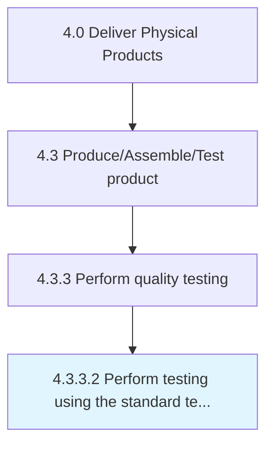

# Perform testing using the standard testing procedure

> Performing testing using calibrated equipment and in consent with the standard testing procedure, including testing time.

## Overview

Activity 4.3.3.2 is an activity within the Deliver Physical Products framework. 

Performing testing using calibrated equipment and in consent with the standard testing procedure, including testing time.

## Process Hierarchy



## Key Statistics

| Metric | Value |
|--------|-------|
| APQC Code | 10374 |
| Hierarchy ID | 4.3.3.2 |
| Level | Activity |
| Parent | [4.3.3](../) |
| Sub-Processes | 0 |


## GraphDL Semantic Structure

```
perform.TestingUsingTheStandardTestingProcedure
```

| Component | Value | Description |
|-----------|-------|-------------|
| Verb | `perform` | Primary action |
| Object | `testing using the standard testing procedure` | Direct object |


## Related Concepts

- TestingUsingStandardTestingProcedure


---

*Source: APQC PCF 10374 (4.3.3.2) - APQC*
