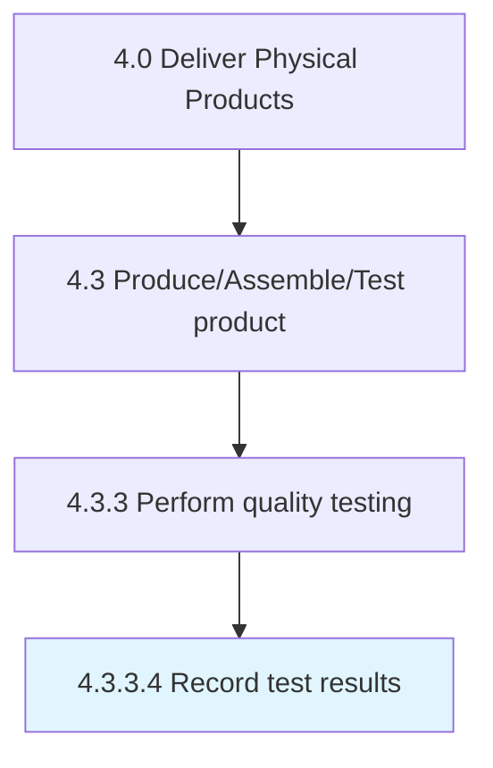

# Record test results

> Documenting the results and outcomes of the quality tests.

## Overview

Activity 4.3.3.4 is an activity within the Deliver Physical Products framework. 

Documenting the results and outcomes of the quality tests. Track the performance of the production process. Record/Document it to evaluate the qualitative efficiency of the production process. Use electronic devices and software in order to ensure effectiveness in recording the results and outcomes of the test.

## Process Hierarchy



## Key Statistics

| Metric | Value |
|--------|-------|
| APQC Code | 10375 |
| Hierarchy ID | 4.3.3.4 |
| Level | Activity |
| Parent | [4.3.3](../) |
| Sub-Processes | 0 |


## GraphDL Semantic Structure

```
record.TestResults
```

| Component | Value | Description |
|-----------|-------|-------------|
| Verb | `record` | Primary action |
| Object | `test results` | Direct object |


## Related Concepts

- [TestResults](/concepts/TestResults)


---

*Source: APQC PCF 10375 (4.3.3.4) - APQC*
