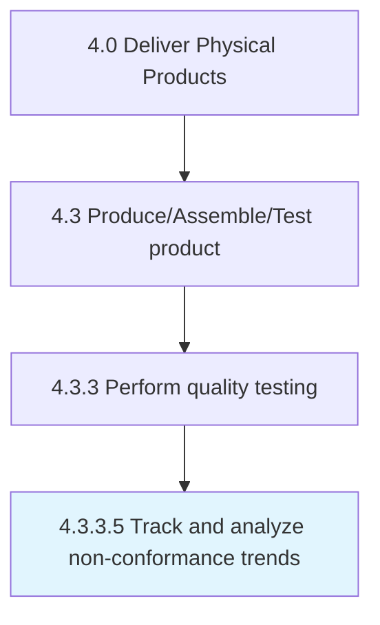

# Track and analyze non-conformance trends

> Managing and monitoring the occurrences of problems with a process or product.

## Overview

Activity 4.3.3.5 is an activity within the Deliver Physical Products framework. 

Managing and monitoring the occurrences of problems with a process or product. It is important that nonconformance occurrences are tracked in a standardized way so the data can easily be reviewed to assess the impact of the problem. Ongoing analysis of trends in nonconformance gives an organization the ability to make process changes to reduce the incidence and cost of nonconformances.

## Process Hierarchy



## Key Statistics

| Metric | Value |
|--------|-------|
| APQC Code | 12045 |
| Hierarchy ID | 4.3.3.5 |
| Level | Activity |
| Parent | [4.3.3](../) |
| Sub-Processes | 0 |


## GraphDL Semantic Structure

```
track.AndAnalyzeNonconformanceTrends
```

| Component | Value | Description |
|-----------|-------|-------------|
| Verb | `track` | Primary action |
| Object | `and analyze non-conformance trends` | Direct object |


---

*Source: APQC PCF 12045 (4.3.3.5) - APQC*
