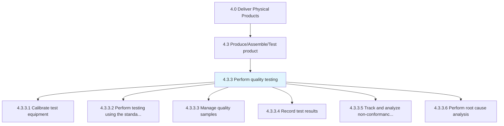
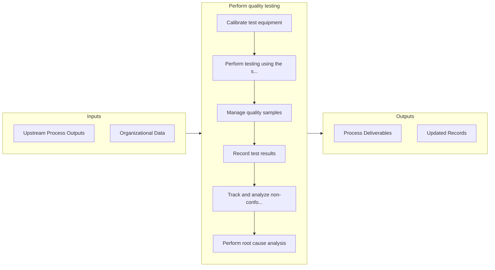

# Perform quality testing

> Executing tests to evaluate the quality of the products manufactured.

## Overview

Process 4.3.3 is a core process that defines the specific procedures for perform quality testing. 

Executing tests to evaluate the quality of the products manufactured. Calibrate the test equipment. Conduct the actual tests. Record the results and outcomes of the quality test conducted.

## Process Hierarchy



## Key Statistics

| Metric | Value |
|--------|-------|
| APQC Code | 10369 |
| Hierarchy ID | 4.3.3 |
| Level | Process |
| Parent | [4.3](../) |
| Sub-Processes | 6 |


## GraphDL Semantic Structure

```
perform.QualityTesting
```

| Component | Value | Description |
|-----------|-------|-------------|
| Verb | `perform` | Primary action |
| Object | `quality testing` | Direct object |


## Process Flow



## Sub-Processes

| Process | Hierarchy ID | Description |
|---------|-------------|-------------|
| [Calibrate test equipment](./CalibrateTestEquipment) | 4.3.3.1 | Regulating the equipment used for performing quality tests |
| [Perform testing using the standard testing procedure](./PerformTestingUsingTheStandardTestingProcedure) | 4.3.3.2 | Performing testing using calibrated equipment and in consent with the standard testing procedure, in |
| [Manage quality samples](./ManageQualitySamples) | 4.3.3.3 | Selecting a set of elements from a product lot to draw conclusions or make inferences about the qual |
| [Record test results](./RecordTestResults) | 4.3.3.4 | Documenting the results and outcomes of the quality tests |
| [Track and analyze non-conformance trends](./TrackAndAnalyzeNonconformanceTrends) | 4.3.3.5 | Managing and monitoring the occurrences of problems with a process or product |
| [Perform root cause analysis](./PerformRootCauseAnalysis) | 4.3.3.6 | Using a technique that helps people answer the question of why a problem occurred in the first place |


## Related Concepts

- [QualityTesting](/concepts/QualityTesting)


---

*Source: APQC PCF 10369 (4.3.3) - APQC*
