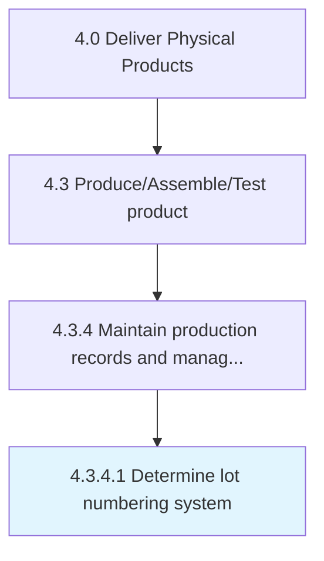

# Determine lot numbering system

> Allotting an identification number to a particular quantity or lot of material manufactured.

## Overview

Activity 4.3.4.1 is an activity within the Deliver Physical Products framework. 

Allotting an identification number to a particular quantity or lot of material manufactured. Assign lot numbers on the basis of specific production units, material similarity, etc. Place lot numbers on the outside of packaging.

## Process Hierarchy



## Key Statistics

| Metric | Value |
|--------|-------|
| APQC Code | 10376 |
| Hierarchy ID | 4.3.4.1 |
| Level | Activity |
| Parent | [4.3.4](../) |
| Sub-Processes | 0 |


## GraphDL Semantic Structure

```
determine.LotNumberingSystem
```

| Component | Value | Description |
|-----------|-------|-------------|
| Verb | `determine` | Primary action |
| Object | `lot numbering system` | Direct object |


## Related Concepts

- LotNumberingSystem


---

*Source: APQC PCF 10376 (4.3.4.1) - APQC*
