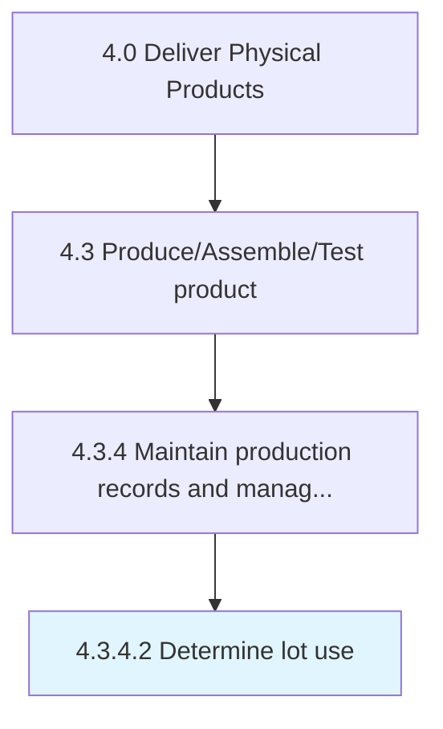

# Determine lot use

> Identifying the use of production lots.

## Overview

Activity 4.3.4.2 is an activity within the Deliver Physical Products framework. 

Identifying the use of production lots. Define where, how, and when to use a specific production lot.

## Process Hierarchy



## Key Statistics

| Metric | Value |
|--------|-------|
| APQC Code | 10377 |
| Hierarchy ID | 4.3.4.2 |
| Level | Activity |
| Parent | [4.3.4](../) |
| Sub-Processes | 0 |


## GraphDL Semantic Structure

```
determine.LotUse
```

| Component | Value | Description |
|-----------|-------|-------------|
| Verb | `determine` | Primary action |
| Object | `lot use` | Direct object |


## Related Concepts

- LotUse


---

*Source: APQC PCF 10377 (4.3.4.2) - APQC*
