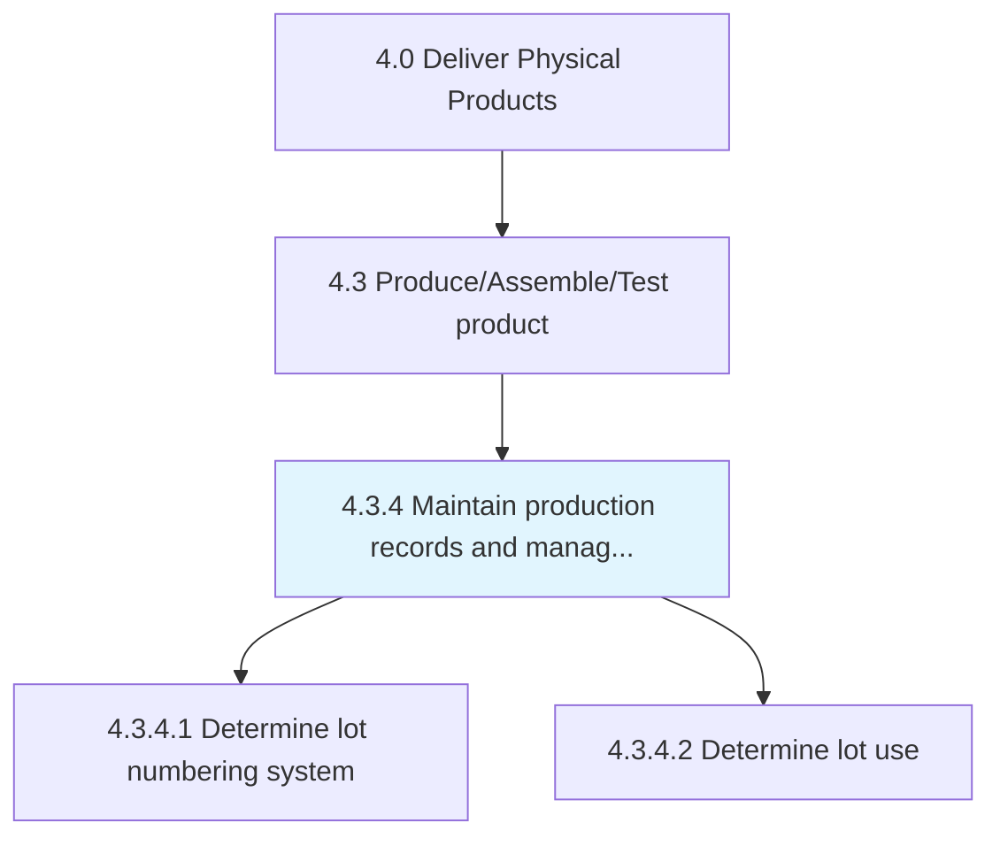
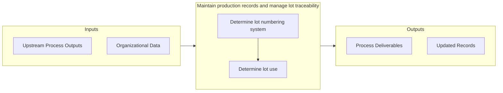

# Maintain production records and manage lot traceability

> Perpetuating the production records by systematically documenting and using it to ensure the effective management of lots.

## Overview

Process 4.3.4 is a core process that defines the specific procedures for maintain production records and manage lot traceability. 

Perpetuating the production records by systematically documenting and using it to ensure the effective management of lots. Determine the lot numbering system and its use. (The lot number enables tracking of the constituent parts, as well as labor and equipment records involved in the manufacturing of a product. It enables manufacturers and to perform quality control checks, calculate expiration dates, and issue corrections of their production output.)

## Process Hierarchy



## Key Statistics

| Metric | Value |
|--------|-------|
| APQC Code | 10370 |
| Hierarchy ID | 4.3.4 |
| Level | Process |
| Parent | [4.3](../) |
| Sub-Processes | 2 |


## GraphDL Semantic Structure

```
maintain.ProductionRecordsAndManageLotTraceability
```

| Component | Value | Description |
|-----------|-------|-------------|
| Verb | `maintain` | Primary action |
| Object | `production records and manage lot traceability` | Direct object |


## Process Flow



## Sub-Processes

| Process | Hierarchy ID | Description |
|---------|-------------|-------------|
| [Determine lot numbering system](./DetermineLotNumberingSystem) | 4.3.4.1 | Allotting an identification number to a particular quantity or lot of material manufactured |
| [Determine lot use](./DetermineLotUse) | 4.3.4.2 | Identifying the use of production lots |


## Related Concepts

- ProductionRecords
- ManageLotTraceability


---

*Source: APQC PCF 10370 (4.3.4) - APQC*
