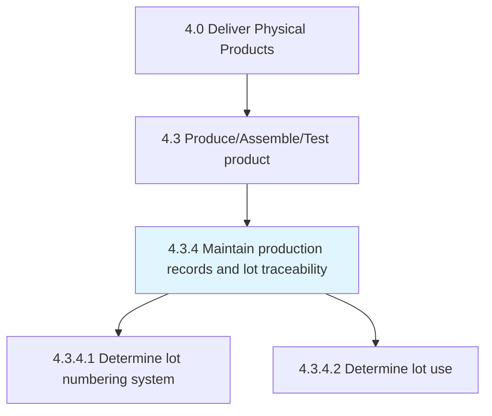
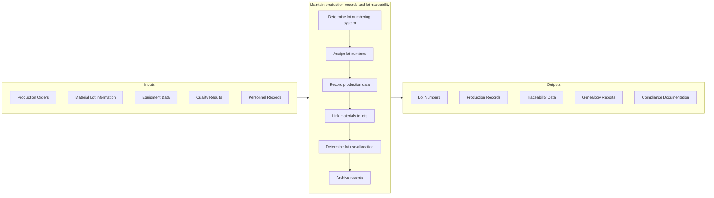

# Maintain production records and manage lot traceability

> Perpetuating the production records by systematically documenting and using it to ensure the effective management of lots.

## Overview

Process 4.3.4 is a core process within [Produce/Assemble/Test Product](../) that ensures comprehensive documentation of manufacturing activities and enables end-to-end traceability of products through lot management. This process is critical for quality control, regulatory compliance, recall management, and continuous improvement.

Production records capture all aspects of manufacturing including materials used, equipment settings, personnel involved, environmental conditions, quality checks, and timing. Lot traceability enables tracking products from raw materials through finished goods and into the distribution chain, supporting rapid response to quality issues and regulatory requirements.

## Process Hierarchy



## Key Statistics

| Metric | Value |
|--------|-------|
| APQC Code | 10370 |
| Hierarchy ID | 4.3.4 |
| Level | Process |
| Parent | [4.3](../) |
| Sub-Processes | 2 |

## GraphDL Semantic Structure

```graphdl
maintain.ProductionRecords.for.LotTraceability
```

| Component | Value | Description |
|-----------|-------|-------------|
| Verb | `maintain` | Primary action of preserving and updating |
| Object | `ProductionRecords` | Manufacturing documentation |
| Preposition | `for` | Purpose relationship |
| PrepObject | `LotTraceability` | Tracking capability |

## Process Flow



## Sub-Processes

| Process | Hierarchy ID | Description |
|---------|-------------|-------------|
| [Determine lot numbering system](./DetermineLotNumberingSystem) | 4.3.4.1 | Establishing systematic lot identification schemes for tracking |
| [Determine lot use](./DetermineLotUse) | 4.3.4.2 | Defining how lots are allocated, consumed, and tracked in production |

## RACI Matrix

| Activity | Responsible | Accountable | Consulted | Informed |
|----------|-------------|-------------|-----------|----------|
| Design lot numbering system | Production Engineering | Plant Manager | Quality, IT | Production |
| Assign lot numbers | Production Operators | Production Supervisor | Quality | Warehouse |
| Record production data | Production Operators | Production Supervisor | Quality | Engineering |
| Maintain traceability links | MES/IT Systems | Production Manager | Quality | Supply Chain |
| Archive production records | Document Control | Quality Manager | Legal, IT | Regulatory |
| Support recall investigations | Quality Team | Quality Director | Production, Legal | Executive |

## Key Stakeholders

- **Production Operations**: Creates and maintains records during manufacturing
- **Quality Assurance**: Uses records for quality control and investigations
- **Regulatory/Compliance**: Ensures documentation meets regulatory requirements
- **Supply Chain**: Tracks materials through production
- **IT/MES**: Maintains systems for record capture and retrieval
- **Customers**: May require traceability documentation

## Metrics and KPIs

| Metric | Description | Target |
|--------|-------------|--------|
| Record Completeness | Production records with all required data | >99.5% |
| Traceability Time | Time to trace lot from finished goods to raw materials | <30 minutes |
| Record Accuracy | Error-free production records | >99% |
| Data Entry Timeliness | Records entered within shift of production | >98% |
| Recall Response Time | Time to identify affected products | <4 hours |
| Audit Readiness | Records available for regulatory audit | 100% |
| Lot Genealogy Accuracy | Correct parent/child lot relationships | >99.9% |
| Record Retention Compliance | Records retained per retention policy | 100% |

## Related Departments

- [Manufacturing](/departments/Operations/Manufacturing) - Production record creation
- [Quality Assurance](/departments/Quality) - Record validation and use
- [Information Technology](/departments/IT) - MES and document systems
- [Supply Chain](/departments/SupplyChain) - Material traceability
- [Regulatory Affairs](/departments/Regulatory) - Compliance documentation

## Related Occupations

- [Industrial Production Managers](/occupations/Management/IndustrialProductionManagers) - Production oversight
- [Quality Control Inspectors](/occupations/QualityControlInspectors) - Quality documentation
- [Computer Systems Analysts](/occupations/Computer/ComputerSystemsAnalysts) - MES administration
- [Logisticians](/occupations/Business/Logisticians) - Supply chain traceability

## Industry Variations

### Life Sciences/Pharmaceutical
Extensive GMP documentation requirements, electronic batch records, 21 CFR Part 11 compliance for electronic signatures, and validated systems for all production records.

### Food and Beverage
FSMA traceability requirements, expiration date management, allergen tracking, and rapid recall capability requirements.

### Automotive
Part serialization, VIN-level traceability, IATF 16949 documentation requirements, and supplier lot linkages.

### Aerospace
AS9100 documentation standards, configuration management, serialized part tracking, and lifetime record retention.

## Related Concepts

- LotTracking
- BatchRecords
- ProductGenealogy
- ManufacturingExecutionSystem
- QualityDocumentation
- RecallManagement
- RegulatoryCompliance

---

*Source: APQC PCF 10370 (4.3.4) - APQC*
