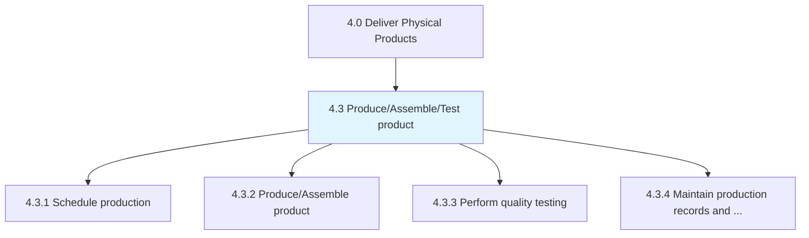
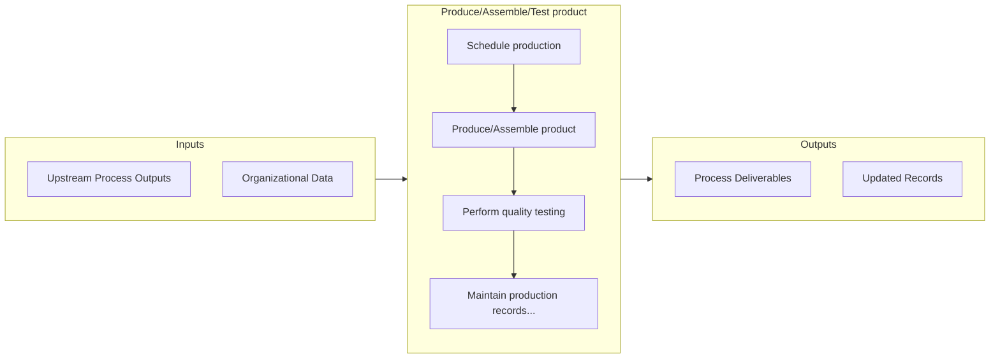

# Produce/Assemble/Test product

> Processing and delivering the finished goods manufactured by the organization.

## Overview

Group 4.3 is a process group within APQC Category 4.0 (Deliver Physical Products). 

Processing and delivering the finished goods manufactured by the organization. Schedule the production of products. Execute the product production activities. Perform tests to oversee and ensure quality of production. Maintain records of the production process. Track lots.

## Process Hierarchy



## Key Statistics

| Metric | Value |
|--------|-------|
| APQC Code | 10217 |
| Hierarchy ID | 4.3 |
| Level | Group |
| Parent | [4](../) |
| Sub-Processes | 4 |


## GraphDL Semantic Structure

```graphdl
produce/assemble/test.Product
```

| Component | Value | Description |
|-----------|-------|-------------|
| Verb | `produce/assemble/test` | Primary action |
| Object | `product` | Direct object |


## Process Flow



## Sub-Processes

| Process | Hierarchy ID | Description |
|---------|-------------|-------------|
| [Schedule production](./4.3.1-ScheduleProduction/) | 4.3.1 | Scheduling the production of final products |
| [Produce/Assemble product](./4.3.2-ProduceAssembleProduct/) | 4.3.2 | Manufacturing the product |
| [Perform quality testing](./4.3.3-PerformQualityTesting/) | 4.3.3 | Executing tests to evaluate the quality of the products manufactured |
| [Maintain production records and manage lot traceability](./4.3.4-MaintainProductionRecordsManage/) | 4.3.4 | Perpetuating the production records by systematically documenting and using it to ensure the effecti |


## Related Concepts

- /Assemble/TestProduct


---

*Source: APQC PCF 10217 (4.3) - APQC*
