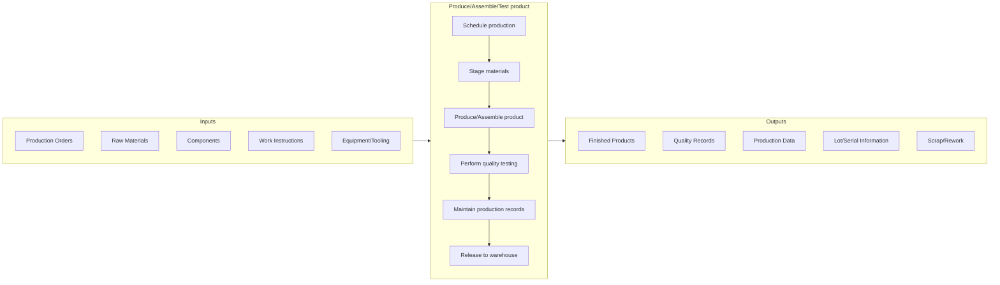

# Produce/Assemble/Test product

> Processing and delivering the finished goods manufactured by the organization.

## Overview

Group 4.3 is a process group within [Deliver Physical Products](../) that encompasses the core manufacturing activities transforming raw materials and components into finished goods. This process group represents the heart of operational execution where production plans become physical products.

The processes within this group manage the complete production cycle from scheduling through quality verification. Effective execution requires close coordination between production planning, materials management, quality assurance, and maintenance functions. Modern manufacturing leverages MES (Manufacturing Execution Systems), automation, and real-time monitoring to optimize throughput, quality, and cost while maintaining flexibility to respond to changing demand.

## Process Hierarchy


## Key Statistics

| Metric | Value |
|--------|-------|
| APQC Code | 10217 |
| Hierarchy ID | 4.3 |
| Level | Group |
| Parent | [4](../) |
| Sub-Processes | 4 |

## GraphDL Semantic Structure

```graphdl
produce.Product.through.Assembly
```

| Component | Value | Description |
|-----------|-------|-------------|
| Verb | `produce` | Primary action of manufacturing |
| Object | `Product` | Finished goods |
| Preposition | `through` | Method relationship |
| PrepObject | `Assembly` | Manufacturing process |

## Process Flow



## Child Processes

| Process | Hierarchy ID | Description |
|---------|-------------|-------------|
| [Schedule production](./4.3.1-ScheduleProduction/) | 4.3.1 | Sequencing and timing production orders based on capacity and priorities |
| [Produce/Assemble product](./4.3.2-ProduceAssembleProduct/) | 4.3.2 | Executing manufacturing operations to create products |
| [Perform quality testing](./4.3.3-PerformQualityTesting/) | 4.3.3 | Verifying products meet specifications through inspection and testing |
| [Maintain production records and lot traceability](./4.3.4-MaintainProductionRecordsManage/) | 4.3.4 | Documenting production activities and enabling product tracking |

## RACI Matrix

| Activity | Responsible | Accountable | Consulted | Informed |
|----------|-------------|-------------|-----------|----------|
| Schedule production | Production Planning | Plant Manager | Sales, Supply Chain | Production |
| Stage materials | Materials Handling | Production Supervisor | Warehouse | Planning |
| Execute production | Production Operators | Production Supervisor | Engineering | Quality |
| Perform quality testing | Quality Inspectors | Quality Manager | Production | Engineering |
| Maintain records | Production/MES | Production Manager | Quality, IT | Management |
| Manage equipment | Maintenance | Maintenance Manager | Production | Engineering |

## Key Stakeholders

- **Production Operations**: Executes manufacturing activities
- **Production Planning**: Schedules and sequences work
- **Quality Assurance**: Ensures product conformance
- **Maintenance**: Keeps equipment operational
- **Engineering**: Provides technical support and improvement
- **Materials Management**: Ensures material availability
- **Plant Management**: Oversees overall performance

## Metrics and KPIs

| Metric | Description | Target |
|--------|-------------|--------|
| Overall Equipment Effectiveness (OEE) | Availability x Performance x Quality | >85% |
| First Pass Yield | Products passing inspection first time | >98% |
| Schedule Adherence | Production completed on schedule | >95% |
| Manufacturing Cycle Time | Time from start to completion | Benchmark |
| Scrap Rate | Percentage of production scrapped | <1% |
| Labor Productivity | Units per labor hour | Continuous improvement |
| Inventory Turns (WIP) | Work-in-process turnover | >12x annually |
| Safety Incident Rate | Recordable incidents per 200K hours | <1.0 |

## Related Departments

- [Manufacturing](/departments/Operations/Manufacturing) - Production execution
- [Quality Assurance](/departments/Quality) - Quality control
- [Maintenance](/departments/Operations/Maintenance) - Equipment support
- [Engineering](/departments/Engineering) - Technical support
- [Supply Chain](/departments/SupplyChain) - Materials coordination

## Related Occupations

- [Industrial Production Managers](/occupations/Management/IndustrialProductionManagers) - Plant oversight
- [First-Line Supervisors of Production Workers](/occupations/Management/FirstLineSupervisors) - Shift management
- [Quality Control Inspectors](/occupations/QualityControlInspectors) - Quality verification
- [Industrial Engineers](/occupations/Engineering/IndustrialEngineers) - Process optimization
- [Machinists](/occupations/Production/Machinists) - Skilled production

## Industry Variations

### Discrete Manufacturing
Focus on assembly operations, work cell optimization, lean manufacturing, and complex BOM management for products like automotive, electronics, and machinery.

### Process Manufacturing
Batch and continuous production, recipe management, process control systems, and strict quality specifications for chemicals, food, and pharmaceuticals.

### Consumer Products
High-volume production, packaging integration, rapid changeovers, and seasonal demand management for consumer goods.

### Aerospace and Defense
Configuration control, rigorous quality documentation, specialized certifications, and traceability requirements throughout production.

## Related Concepts

- ManufacturingExecution
- ProductionScheduling
- QualityControl
- LeanManufacturing
- ProcessOptimization
- EquipmentEffectiveness
- ProductTraceability

---

*Source: APQC PCF 10217 (4.3) - APQC*
