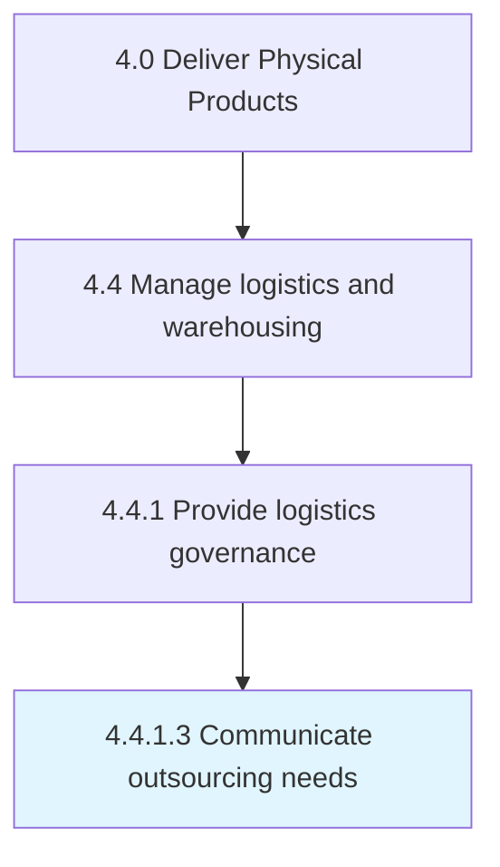

# Communicate outsourcing needs

> Conveying outsourcing needs within the organization, with the objective of sourcing the assistance required.

## Overview

Activity 4.4.1.3 is an activity within the Deliver Physical Products framework. 

Conveying outsourcing needs within the organization, with the objective of sourcing the assistance required. Define the portion of logistical activities that can be transferred to outside suppliers. Assess third-party agencies to carefully select the most appropriate agencies for outsourcing. Convey these needs to management or the appropriate authority.

## Process Hierarchy



## Key Statistics

| Metric | Value |
|--------|-------|
| APQC Code | 10345 |
| Hierarchy ID | 4.4.1.3 |
| Level | Activity |
| Parent | [4.4.1](../) |
| Sub-Processes | 0 |


## GraphDL Semantic Structure

```
communicate.OutsourcingNeeds
```

| Component | Value | Description |
|-----------|-------|-------------|
| Verb | `communicate` | Primary action |
| Object | `outsourcing needs` | Direct object |


## Related Concepts

- [OutsourcingNeeds](/concepts/OutsourcingNeeds)


---

*Source: APQC PCF 10345 (4.4.1.3) - APQC*
