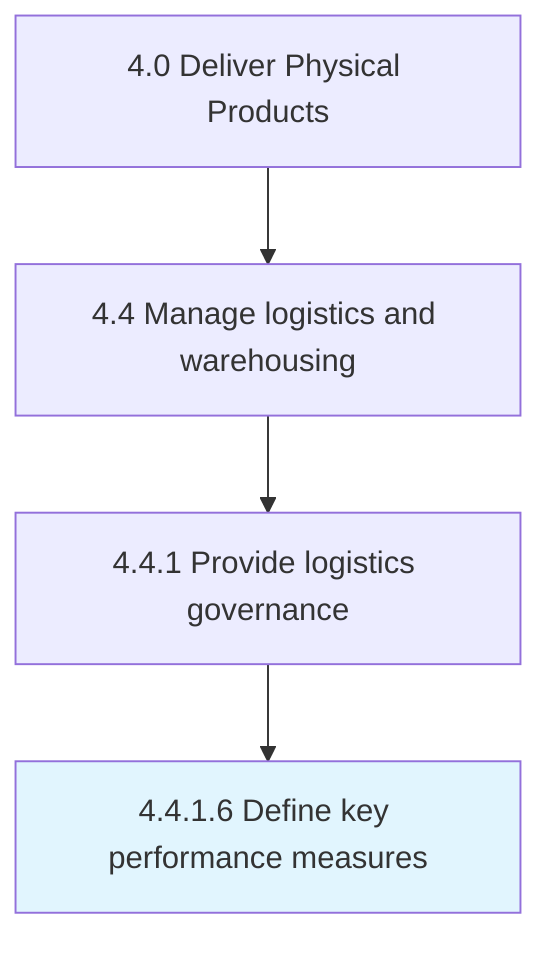

# Define key performance measures

> Establishing measures for evaluating the performance of the logistics strategy of the organization.

## Overview

Activity 4.4.1.6 is an activity within the Deliver Physical Products framework. 

Establishing measures for evaluating the performance of the logistics strategy of the organization. Establish key performance indicators, including the logistics performance index, delivery in full, and delivery on time.

## Process Hierarchy



## Key Statistics

| Metric | Value |
|--------|-------|
| APQC Code | 10348 |
| Hierarchy ID | 4.4.1.6 |
| Level | Activity |
| Parent | [4.4.1](../) |
| Sub-Processes | 0 |


## GraphDL Semantic Structure

```
define.KeyPerformanceMeasures
```

| Component | Value | Description |
|-----------|-------|-------------|
| Verb | `define` | Primary action |
| Object | `key performance measures` | Direct object |


## Related Concepts

- KeyPerformanceMeasures


---

*Source: APQC PCF 10348 (4.4.1.6) - APQC*
