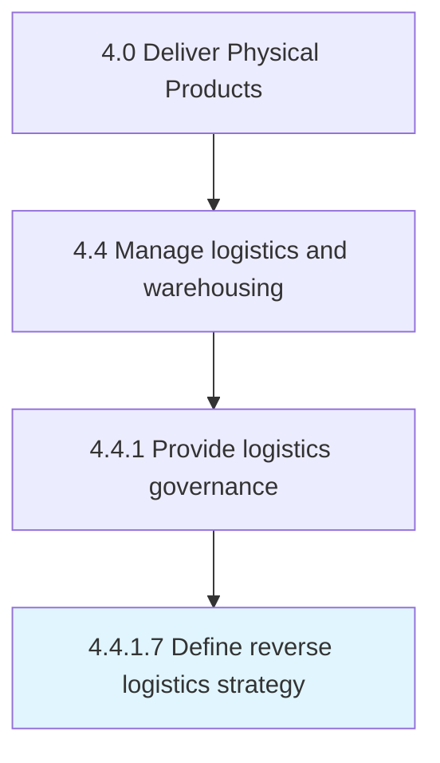
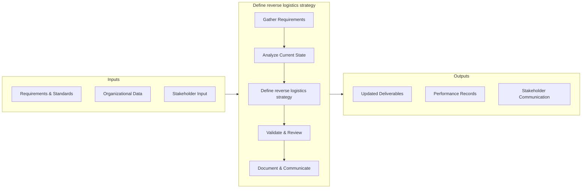
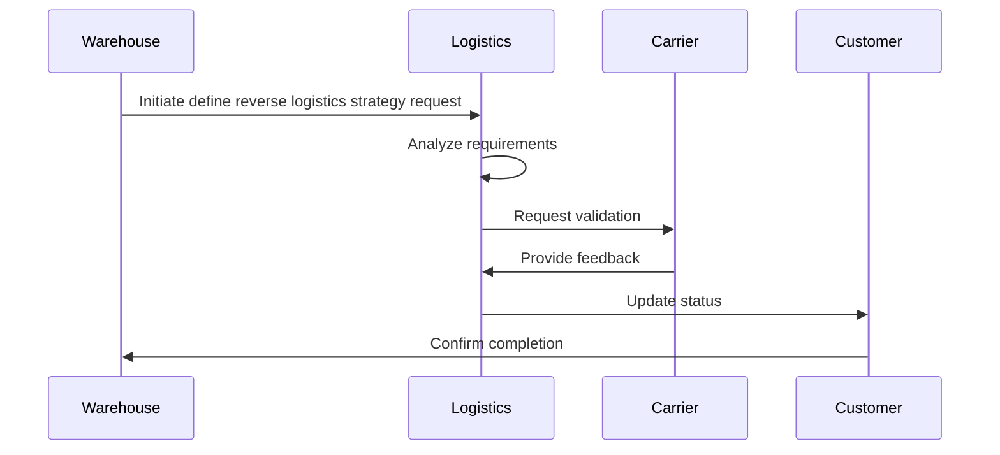

# Define reverse logistics strategy

> Establish a strategy that includes rules and regulations for the physical handling, information processing, and disposition of product and packaging returned by the buyer to the seller or an intermediary.

## Overview

This activity encompasses the end-to-end process of define reverse logistics strategy within the supply chain and physical product delivery domain. It involves coordinating cross-functional teams, applying standardized methodologies, and leveraging organizational data to ensure consistent and effective outcomes. The process is aligned with the broader Deliver Physical Products framework (APQC 4.4.1.7) and supports strategic objectives by translating operational requirements into actionable procedures.

Effective execution of this activity requires clear ownership, well-defined inputs and outputs, and continuous monitoring against established benchmarks. Organizations that excel at this process typically integrate it with upstream planning activities and downstream performance measurement, creating a feedback loop that drives ongoing improvement and adaptation to changing business conditions.


## Process Hierarchy



## Key Statistics

| Metric | Value |
|--------|-------|
| APQC Code | 16905 |
| Hierarchy ID | 4.4.1.7 |
| Level | Activity |
| Parent | [4.4.1](../) |
| Sub-Processes | 0 |


## GraphDL Semantic Structure

```graphdl
define.ReverseLogisticsStrategy
```

| Component | Value | Description |
|-----------|-------|-------------|
| Verb | `define` | Primary action |
| Object | `reverse logistics strategy` | Direct object |


## Process Flow




## Process Sequence


## RACI Matrix

| Activity | Production Manager | Supply Chain Director | Quality Assurance Team | Finance Department |
|----------|:-:|:-:|:-:|:-:|
| Gather Requirements | R | A | C | I |
| Analyze Current State | R | I | C | I |
| Define reverse logistics strategy | R | A | C | I |
| Validate & Review | C | A | R | I |
| Document & Communicate | R | I | I | C |

## Related Occupations

- [Supply Chain Manager](/occupations/Management/SupplyChainManagers)
- [Logistics Analyst](/occupations/Business/LogisticsAnalysts)
- [Production Manager](/occupations/ProductionManagers)
- [Warehouse Manager](/occupations/WarehouseManagers)

## Related Departments

- Supply Chain & Logistics
- Manufacturing & Production
- Quality Assurance

## Industry Variations

### Manufacturing
Emphasis on lean production, JIT inventory, and continuous improvement methodologies such as Six Sigma and Kaizen.

### Retail
Focus on omnichannel fulfillment, last-mile delivery optimization, and seasonal demand management.

### Automotive
Integration of complex multi-tier supplier networks with assembly line synchronization and recall management.

## KPIs & Metrics

| KPI | Description | Unit |
|-----|-------------|------|
| Cycle Time | Average time to complete define reverse logistics strategy process | Hours/Days |
| Completion Rate | Percentage of reverse logistics strategy activities completed on schedule | % |
| Quality Score | Accuracy and quality rating of reverse logistics strategy outputs | 1-10 Scale |
| Cost Efficiency | Cost per unit of reverse logistics strategy processed | $/Unit |
| On-Time Delivery | Percentage of deliverables completed within target timeline | % |

## Related Concepts

- ReverseLogisticsStrategy


---

*Source: APQC PCF 16905 (4.4.1.7) - APQC*
