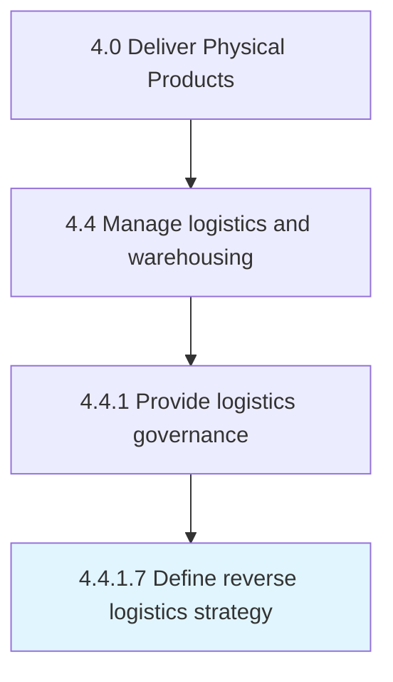

# Define reverse logistics strategy

> Establish a strategy that includes rules and regulations for the physical handling, information processing, and disposition of product and packaging returned by the buyer to the seller or an intermediary.

## Overview

Activity 4.4.1.7 is an activity within the Deliver Physical Products framework. 

Establish a strategy that includes rules and regulations for the physical handling, information processing, and disposition of product and packaging returned by the buyer to the seller or an intermediary. Include return approval, transportation coordination, advance communication, product tracking, receipt, disposition of the return, and processing warranty claims in the strategy.

## Process Hierarchy



## Key Statistics

| Metric | Value |
|--------|-------|
| APQC Code | 16905 |
| Hierarchy ID | 4.4.1.7 |
| Level | Activity |
| Parent | [4.4.1](../) |
| Sub-Processes | 0 |


## GraphDL Semantic Structure

```
define.ReverseLogisticsStrategy
```

| Component | Value | Description |
|-----------|-------|-------------|
| Verb | `define` | Primary action |
| Object | `reverse logistics strategy` | Direct object |


## Related Concepts

- ReverseLogisticsStrategy


---

*Source: APQC PCF 16905 (4.4.1.7) - APQC*
