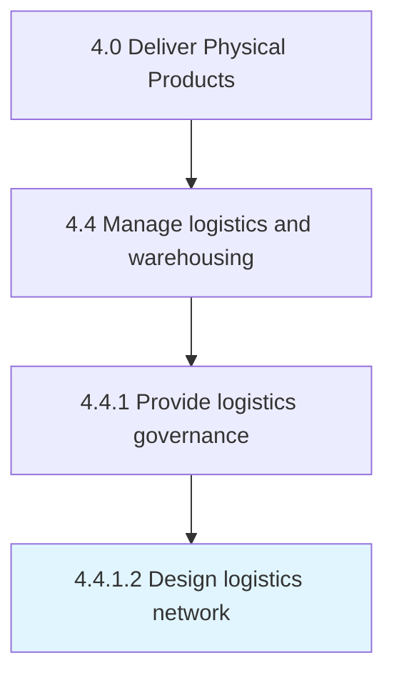

# Design logistics network

> Developing a network for logistical activities.

## Overview

Activity 4.4.1.2 is an activity within the Deliver Physical Products framework. 

Developing a network for logistical activities. Create a network of entities through which materials and information flow, encompassing all related activities associated with the flow of transformation of products.

## Process Hierarchy



## Key Statistics

| Metric | Value |
|--------|-------|
| APQC Code | 10344 |
| Hierarchy ID | 4.4.1.2 |
| Level | Activity |
| Parent | [4.4.1](../) |
| Sub-Processes | 0 |


## GraphDL Semantic Structure

```
design.LogisticsNetwork
```

| Component | Value | Description |
|-----------|-------|-------------|
| Verb | `design` | Primary action |
| Object | `logistics network` | Direct object |


## Related Concepts

- LogisticsNetwork


---

*Source: APQC PCF 10344 (4.4.1.2) - APQC*
