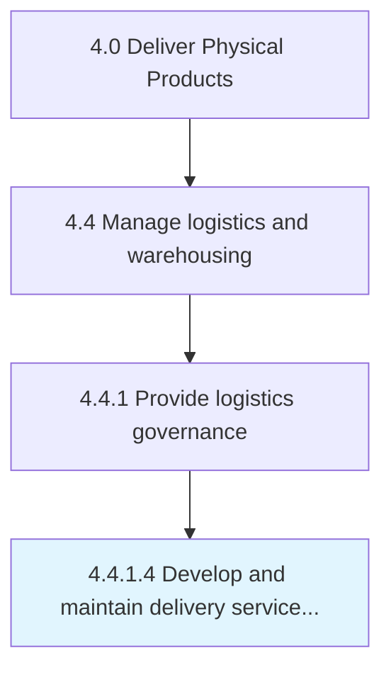

# Develop and maintain delivery service policy

> Establishing rules and regulations, as well as the terms and conditions regarding the delivery of service by the company.

## Overview

Activity 4.4.1.4 is an activity within the Deliver Physical Products framework. 

Establishing rules and regulations, as well as the terms and conditions regarding the delivery of service by the company. Develop a delivery plan that specifies what, how, when, and in which way to deliver services to the customer.

## Process Hierarchy



## Key Statistics

| Metric | Value |
|--------|-------|
| APQC Code | 10346 |
| Hierarchy ID | 4.4.1.4 |
| Level | Activity |
| Parent | [4.4.1](../) |
| Sub-Processes | 0 |


## GraphDL Semantic Structure

```
develop.AndMaintainDeliveryServicePolicy
```

| Component | Value | Description |
|-----------|-------|-------------|
| Verb | `develop` | Primary action |
| Object | `and maintain delivery service policy` | Direct object |


## Related Concepts

- DeliveryServicePolicy
- DeliveryServicePolicy


---

*Source: APQC PCF 10346 (4.4.1.4) - APQC*
