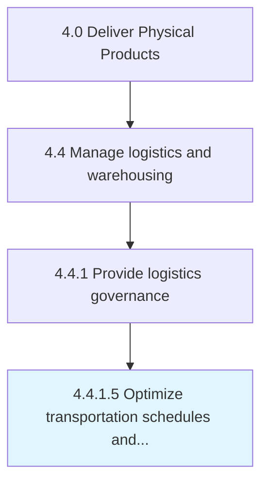

# Optimize transportation schedules and costs

> Optimizing the schedule and costs of transportation services.

## Overview

Activity 4.4.1.5 is an activity within the Deliver Physical Products framework. 

Optimizing the schedule and costs of transportation services. Design a logistics strategy by strategically creating delivery routes and systems, which optimizes the overall transportation schedules and costs. Evaluate different transportation sources in order to select the most appropriate and cost-effective sources.

## Process Hierarchy



## Key Statistics

| Metric | Value |
|--------|-------|
| APQC Code | 10347 |
| Hierarchy ID | 4.4.1.5 |
| Level | Activity |
| Parent | [4.4.1](../) |
| Sub-Processes | 0 |


## GraphDL Semantic Structure

```
optimize.TransportationSchedulesAndCosts
```

| Component | Value | Description |
|-----------|-------|-------------|
| Verb | `optimize` | Primary action |
| Object | `transportation schedules and costs` | Direct object |


## Related Concepts

- [TransportationSchedules](/concepts/TransportationSchedules)
- [Costs](/concepts/Costs)


---

*Source: APQC PCF 10347 (4.4.1.5) - APQC*
