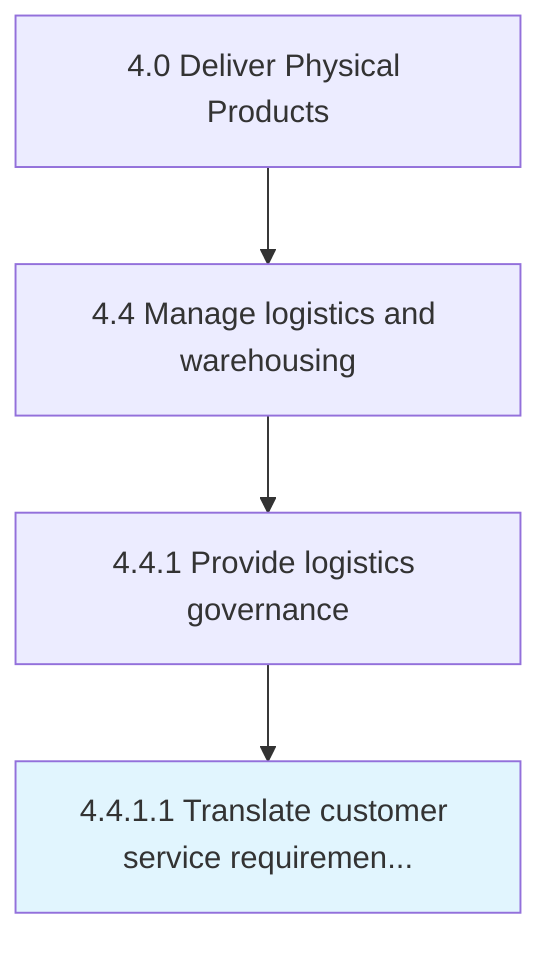

# Translate customer service requirements into logistics requirements

> Determining the requirements for managing the flow of things between the point of origin and the point of consumption by assessing the service requirements of the customers.

## Overview

Activity 4.4.1.1 is an activity within the Deliver Physical Products framework. 

Determining the requirements for managing the flow of things between the point of origin and the point of consumption by assessing the service requirements of the customers.

## Process Hierarchy



## Key Statistics

| Metric | Value |
|--------|-------|
| APQC Code | 10343 |
| Hierarchy ID | 4.4.1.1 |
| Level | Activity |
| Parent | [4.4.1](../) |
| Sub-Processes | 0 |


## GraphDL Semantic Structure

```
translate.CustomerServiceRequirements.into.LogisticsRequirements
```

| Component | Value | Description |
|-----------|-------|-------------|
| Verb | `translate` | Primary action |
| Object | `customer service requirements` | Direct object |
| Preposition | `into` | Relationship |
| PrepObject | `logistics requirements` | Indirect object |


## Related Concepts

- CustomerServiceRequirements
- LogisticsRequirements


---

*Source: APQC PCF 10343 (4.4.1.1) - APQC*
