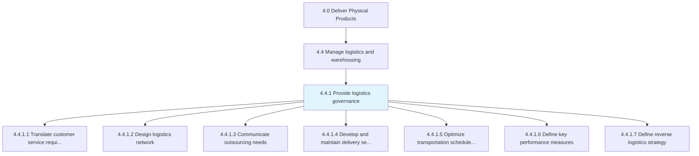
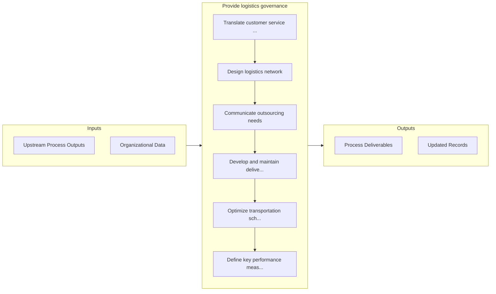

# Provide logistics governance

> Outlining the strategy for managing logistics.

## Overview

Process 4.4.1 is a core process that defines the specific procedures for provide logistics governance. 

Outlining the strategy for managing logistics. Translate customer requirements logistic requirements. Create an efficient logistic network and outsourcing portions of logistics activities. Design a logistics strategy that optimizes transportation costs and schedule. Define key performance indicators.

## Process Hierarchy



## Key Statistics

| Metric | Value |
|--------|-------|
| APQC Code | 10338 |
| Hierarchy ID | 4.4.1 |
| Level | Process |
| Parent | [4.4](../) |
| Sub-Processes | 7 |


## GraphDL Semantic Structure

```
provide.LogisticsGovernance
```

| Component | Value | Description |
|-----------|-------|-------------|
| Verb | `provide` | Primary action |
| Object | `logistics governance` | Direct object |


## Process Flow



## Sub-Processes

| Process | Hierarchy ID | Description |
|---------|-------------|-------------|
| [Translate customer service requirements into logistics requirements](./TranslateCustomerServiceRequirementsIntoLogisticsRequirements) | 4.4.1.1 | Determining the requirements for managing the flow of things between the point of origin and the poi |
| [Design logistics network](./DesignLogisticsNetwork) | 4.4.1.2 | Developing a network for logistical activities |
| [Communicate outsourcing needs](./CommunicateOutsourcingNeeds) | 4.4.1.3 | Conveying outsourcing needs within the organization, with the objective of sourcing the assistance r |
| [Develop and maintain delivery service policy](./DevelopAndMaintainDeliveryServicePolicy) | 4.4.1.4 | Establishing rules and regulations, as well as the terms and conditions regarding the delivery of se |
| [Optimize transportation schedules and costs](./OptimizeTransportationSchedulesAndCosts) | 4.4.1.5 | Optimizing the schedule and costs of transportation services |
| [Define key performance measures](./DefineKeyPerformanceMeasures) | 4.4.1.6 | Establishing measures for evaluating the performance of the logistics strategy of the organization |
| [Define reverse logistics strategy](./DefineReverseLogisticsStrategy) | 4.4.1.7 | Establish a strategy that includes rules and regulations for the physical handling, information proc |


## Related Concepts

- [LogisticsGovernance](/concepts/LogisticsGovernance)


---

*Source: APQC PCF 10338 (4.4.1) - APQC*
