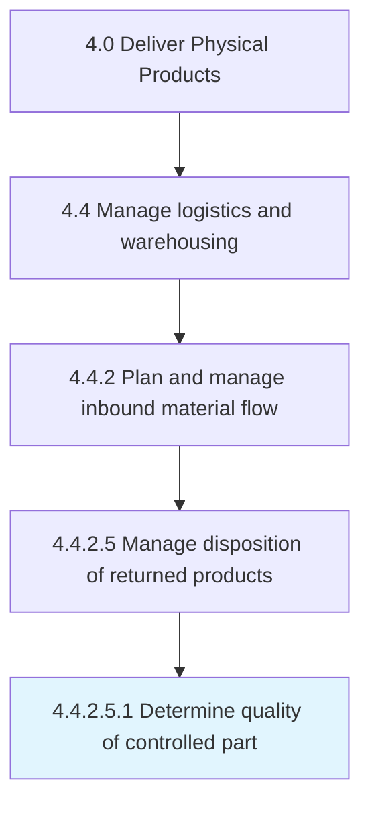

# Determine quality of controlled part

> Implement a checks and balances system to verify that returned parts meet acceptable quality standards to determine appropriate disposition activity.

## Overview

Sub-Activity 4.4.2.5.1 is an activity within the Deliver Physical Products framework. 

Implement a checks and balances system to verify that returned parts meet acceptable quality standards to determine appropriate disposition activity.

## Process Hierarchy



## Key Statistics

| Metric | Value |
|--------|-------|
| APQC Code | 12708 |
| Hierarchy ID | 4.4.2.5.1 |
| Level | Sub-Activity |
| Parent | [4.4.2.5](../) |
| Sub-Processes | 0 |


## GraphDL Semantic Structure

```
determine.Quality.of.ControlledPart
```

| Component | Value | Description |
|-----------|-------|-------------|
| Verb | `determine` | Primary action |
| Object | `quality` | Direct object |
| Preposition | `of` | Relationship |
| PrepObject | `controlled part` | Indirect object |


## Related Concepts

- Quality
- ControlledPart


---

*Source: APQC PCF 12708 (4.4.2.5.1) - APQC*
