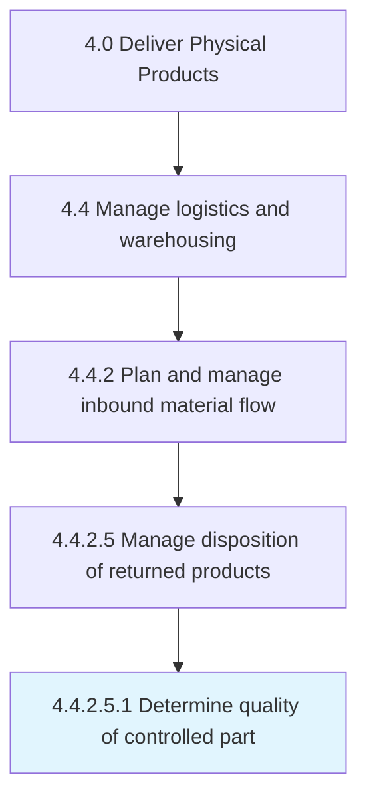
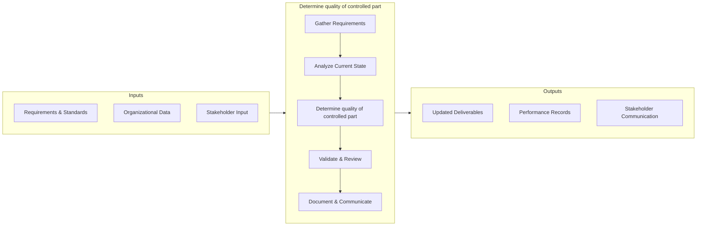

# Determine quality of controlled part

> Implement a checks and balances system to verify that returned parts meet acceptable quality standards to determine appropriate disposition activity.

## Overview

This activity encompasses the end-to-end process of determine quality of controlled part within the supply chain and physical product delivery domain. It involves coordinating cross-functional teams, applying standardized methodologies, and leveraging organizational data to ensure consistent and effective outcomes. The process is aligned with the broader Deliver Physical Products framework (APQC 4.4.2.5.1) and supports strategic objectives by translating operational requirements into actionable procedures.

Effective execution of this activity requires clear ownership, well-defined inputs and outputs, and continuous monitoring against established benchmarks. Organizations that excel at this process typically integrate it with upstream planning activities and downstream performance measurement, creating a feedback loop that drives ongoing improvement and adaptation to changing business conditions.


## Process Hierarchy



## Key Statistics

| Metric | Value |
|--------|-------|
| APQC Code | 12708 |
| Hierarchy ID | 4.4.2.5.1 |
| Level | Sub-Activity |
| Parent | [4.4.2.5](../) |
| Sub-Processes | 0 |


## GraphDL Semantic Structure

```graphdl
determine.Quality.of.ControlledPart
```

| Component | Value | Description |
|-----------|-------|-------------|
| Verb | `determine` | Primary action |
| Object | `quality` | Direct object |
| Preposition | `of` | Relationship |
| PrepObject | `controlled part` | Indirect object |


## Process Flow



## RACI Matrix

| Activity | Production Manager | Supply Chain Director | Quality Assurance Team | Finance Department |
|----------|:-:|:-:|:-:|:-:|
| Gather Requirements | R | A | C | I |
| Analyze Current State | R | I | C | I |
| Determine quality of controlled part | R | A | C | I |
| Validate & Review | C | A | R | I |
| Document & Communicate | R | I | I | C |

## Related Occupations

- [Supply Chain Manager](/occupations/Management/SupplyChainManagers)
- [Logistics Analyst](/occupations/Business/LogisticsAnalysts)
- [Production Manager](/occupations/ProductionManagers)
- [Warehouse Manager](/occupations/WarehouseManagers)

## Related Departments

- Supply Chain & Logistics
- Manufacturing & Production
- Quality Assurance

## Industry Variations

### Manufacturing
Emphasis on lean production, JIT inventory, and continuous improvement methodologies such as Six Sigma and Kaizen.

### Retail
Focus on omnichannel fulfillment, last-mile delivery optimization, and seasonal demand management.

### Automotive
Integration of complex multi-tier supplier networks with assembly line synchronization and recall management.

## KPIs & Metrics

| KPI | Description | Unit |
|-----|-------------|------|
| Cycle Time | Average time to complete determine quality process | Hours/Days |
| Completion Rate | Percentage of quality activities completed on schedule | % |
| Quality Score | Accuracy and quality rating of quality outputs | 1-10 Scale |
| Cost Efficiency | Cost per unit of quality processed | $/Unit |
| On-Time Delivery | Percentage of deliverables completed within target timeline | % |

## Related Concepts

- Quality
- ControlledPart


---

*Source: APQC PCF 12708 (4.4.2.5.1) - APQC*
