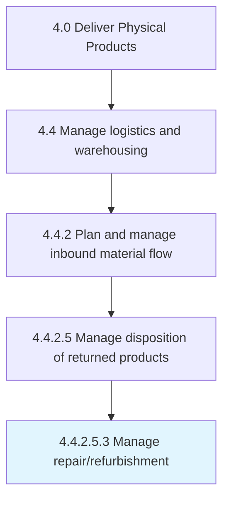

# Manage repair/refurbishment

> Administering the reinstatement of the returned product in order to return them back to customers.

## Overview

Sub-Activity 4.4.2.5.3 is an activity within the Deliver Physical Products framework. 

Administering the reinstatement of the returned product in order to return them back to customers. Repair or remanufacture the defective or ineffective products returned by the customer. Process the delivery of the repaired or remanufactured products back to the customer.

## Process Hierarchy



## Key Statistics

| Metric | Value |
|--------|-------|
| APQC Code | 21604 |
| Hierarchy ID | 4.4.2.5.3 |
| Level | Sub-Activity |
| Parent | [4.4.2.5](../) |
| Sub-Processes | 0 |


## GraphDL Semantic Structure

```
manage.Repairrefurbishment
```

| Component | Value | Description |
|-----------|-------|-------------|
| Verb | `manage` | Primary action |
| Object | `repair/refurbishment` | Direct object |


## Related Concepts

- Repair
- Refurbishment


---

*Source: APQC PCF 21604 (4.4.2.5.3) - APQC*
