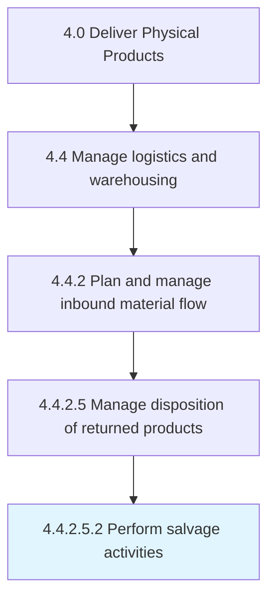

# Perform salvage activities

> Executing activities for reinstating the returned products.

## Overview

Sub-Activity 4.4.2.5.2 is an activity within the Deliver Physical Products framework. 

Executing activities for reinstating the returned products. Present the customer with additional incentives of compensation in case of any defective products delivery or any discrepancy in the product specifications in order to save the order from being permanently returned.

## Process Hierarchy



## Key Statistics

| Metric | Value |
|--------|-------|
| APQC Code | 10366 |
| Hierarchy ID | 4.4.2.5.2 |
| Level | Sub-Activity |
| Parent | [4.4.2.5](../) |
| Sub-Processes | 0 |


## GraphDL Semantic Structure

```
perform.SalvageActivities
```

| Component | Value | Description |
|-----------|-------|-------------|
| Verb | `perform` | Primary action |
| Object | `salvage activities` | Direct object |


## Related Concepts

- [SalvageActivities](/concepts/SalvageActivities)


---

*Source: APQC PCF 10366 (4.4.2.5.2) - APQC*
