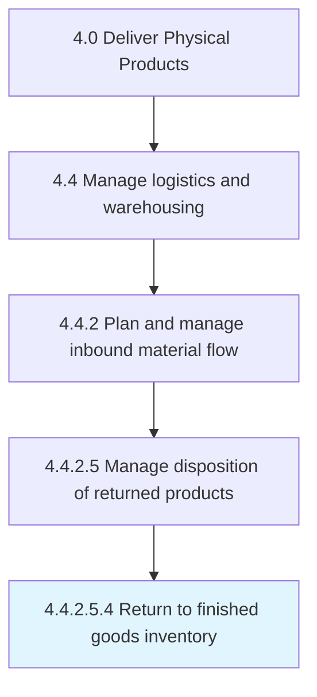

# Return to finished goods inventory

> Moving a returned product back to inventory or stock.

## Overview

Sub-Activity 4.4.2.5.4 is an activity within the Deliver Physical Products framework. 

Moving a returned product back to inventory or stock. Whether a product is sufficient as returned, repaired, or refurbished, moving that product back to inventory for resale or returning to customer is the fnal step in Manage disposition of returned products.

## Process Hierarchy



## Key Statistics

| Metric | Value |
|--------|-------|
| APQC Code | 21605 |
| Hierarchy ID | 4.4.2.5.4 |
| Level | Sub-Activity |
| Parent | [4.4.2.5](../) |
| Sub-Processes | 0 |


## GraphDL Semantic Structure

```
return.ToFinishedGoodsInventory
```

| Component | Value | Description |
|-----------|-------|-------------|
| Verb | `return` | Primary action |
| Object | `to finished goods inventory` | Direct object |


## Related Concepts

- [FinishedGoodsInventory](/concepts/FinishedGoodsInventory)


---

*Source: APQC PCF 21605 (4.4.2.5.4) - APQC*
