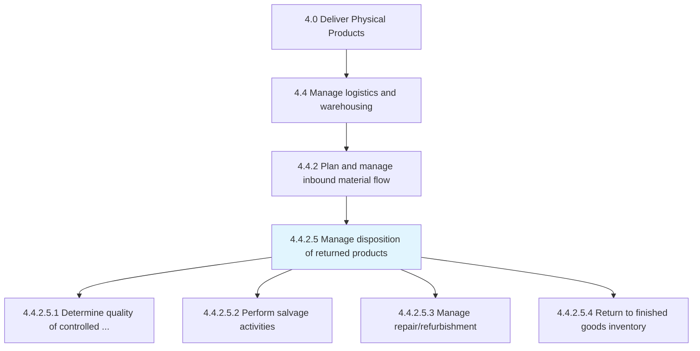
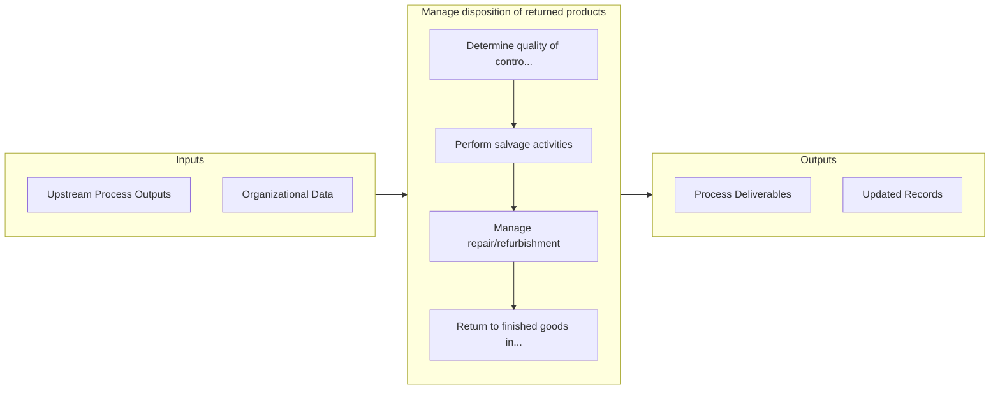

# Manage disposition of returned products

> Determining if a returned product can be salvaged or repaired.

## Overview

Activity 4.4.2.5 is an activity within the Deliver Physical Products framework. 

Determining if a returned product can be salvaged or repaired. Salvage or repair is dependent upon the product, the condition of the product, or the availability of a like item.

## Process Hierarchy



## Key Statistics

| Metric | Value |
|--------|-------|
| APQC Code | 20109 |
| Hierarchy ID | 4.4.2.5 |
| Level | Activity |
| Parent | [4.4.2](../) |
| Sub-Processes | 4 |


## GraphDL Semantic Structure

```graphdl
manage.Disposition.of.ReturnedProducts
```

| Component | Value | Description |
|-----------|-------|-------------|
| Verb | `manage` | Primary action |
| Object | `disposition` | Direct object |
| Preposition | `of` | Relationship |
| PrepObject | `returned products` | Indirect object |


## Process Flow



## Sub-Processes

| Process | Hierarchy ID | Description |
|---------|-------------|-------------|
| [Determine quality of controlled part](./DetermineQualityOfControlledPart) | 4.4.2.5.1 | Implement a checks and balances system to verify that returned parts meet acceptable quality standar |
| [Perform salvage activities](./PerformSalvageActivities) | 4.4.2.5.2 | Executing activities for reinstating the returned products |
| [Manage repair/refurbishment](./ManageRepairrefurbishment) | 4.4.2.5.3 | Administering the reinstatement of the returned product in order to return them back to customers |
| [Return to finished goods inventory](./ReturnToFinishedGoodsInventory) | 4.4.2.5.4 | Moving a returned product back to inventory or stock |


## Related Concepts

- Disposition
- ReturnedProducts


---

*Source: APQC PCF 20109 (4.4.2.5) - APQC*
